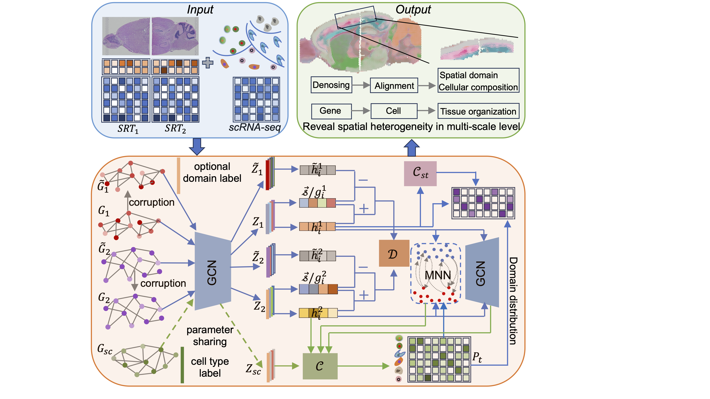

# Overview

SMILE is designed for multiscale dissection of spatial heterogeneity by integrating multi-slice spatial and single-cell transcriptomics.

The input data of SMILE are the gene expression profiles of spots, spot coordinates and scRNA-seq data reference. The core algorithm of SIMLE includes two key modules, one is for SRT data modeling indicated by blue lines and the other is for scRNA-seq data modeling marked by green lines. Dashed green lines represent parameter sharing strategy. The outputs of SIMLE are denoised SRT data, aligned embeddings of different slices, identified spatial domains and estimated cell type compositions of each spot. 