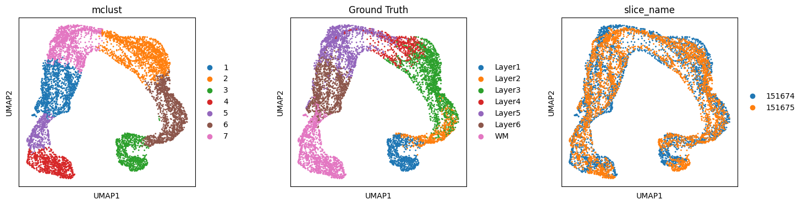
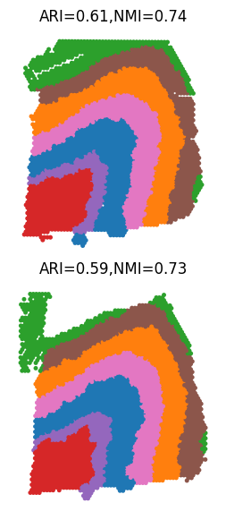

```python
import scanpy as sc
import anndata as ad
import scanpy.external as sce
import matplotlib.pyplot as plt
import numpy as np
import pandas as pd
import squidpy as sq
import scipy.sparse as sp
from scipy import sparse
from scipy.sparse import csr_matrix
import math
import torch
import torch.nn as nn
import time
import torch.nn.functional as F
from itertools import chain
from scanpy import read_10x_h5
import torch.optim as optim
import sklearn
from sklearn.neighbors import kneighbors_graph
import gudhi
import networkx as nx
from torch_geometric.nn import GCNConv
import random
import os
import json 
import matplotlib.image as mpimg
import warnings
warnings.filterwarnings('ignore')
```


```python
# pwd
os.getcwd()
```


    '/Users/lihuazhang/Documents/stSMILE/tutorial'


```python
os.chdir('/Users/lihuazhang/Documents/stSMILE')
```

# load data


```python
section_ids = ['151674','151675']
print(section_ids)
```

    ['151674', '151675']


```python
def label_to_int(adataA, label_list, label_name):
    adata_label = np.array(adataA.obs[label_name].copy())
    for i in range(len(label_list)):
        need_index = np.where(adataA.obs[label_name]==label_list[i])[0]
        if len(need_index):
            adata_label[need_index] = i
    adataA.obs['ref'] = adata_label
    return adataA
```


```python
adata_l = []
for i in range(len(section_ids)):
    adata_i = sc.read_h5ad('/Users/lihuazhang/Documents/stSMILE/Dataset/DLPFC/DLPFC_'+ section_ids[i]+'_ST_final.h5ad')
    adata_i.obs_names = [x+'_'+section_ids[i] for x in adata_i.obs_names]
    adata_l.append(adata_i)
```


```python
# convert label to int
label_list = ['Layer1', 'Layer2', 'Layer3', 'Layer4', 'Layer5', 'Layer6', 'WM']
```


```python
for i in range(len(section_ids)):
    adata_l[i] = label_to_int(adata_l[i], label_list, 'Ground Truth')
```


```python
adata0_sc = sc.read_h5ad('/Users/lihuazhang/Documents/stSMILE/Dataset/DLPFC/DLPFC_sc_final.h5ad') 
```


```python
adata0_sc
```


    AnnData object with n_obs × n_vars = 19764 × 3010
        obs: 'orig.ident', 'nCount_RNA', 'nFeature_RNA', 'cell_type', 'cell_subtype', 'subject', 'condition', 'batch', 'n_genes', 'ref'
        var: 'features', 'n_cells', 'n_counts'
        uns: 'rank_genes_groups'
        obsm: 'X_pca'
        obsp: 'adj_f'


```python
label0_list = adata0_sc.obs['cell_subtype'].tolist()
adata0_label_new = adata0_sc.obs['cell_subtype'].tolist()
for i in range(len(label0_list)):
    need_index = np.where(adata0_sc.obs['cell_subtype'] == label0_list[i])[0]    
    if len(need_index):
        for p in range(len(need_index)):
            adata0_label_new[need_index[p]] = i  
```


```python
adata0_sc.obs['ref'] = pd.Series(adata0_label_new, index = adata0_sc.obs['cell_subtype'].index)
adata0_sc.obs['ref'] = adata0_sc.obs['ref'].astype(str)
adata0_sc.obs['ref'] = adata0_sc.obs['ref'].astype('category')
adata0_sc.obs['Ground Truth'] = adata0_sc.obs['cell_subtype']
```


```python
adata_l.append(adata0_sc)
```


```python
len(adata_l)
```


    3


# Run SMILE


```python
import stSMILE
from stSMILE import SMILE
```


```python
in_features = len(adata_l[0].var.index)
hidden_features = 512
out_features = 50
```


```python
tag_l = ['ST','ST','single cell']
```


```python
feature_method = 'GCNConv'
alpha = 1
beta = 1
gamma = 1000
lamb = 1
theta = 0.9
spatial_regularization_strength= 0.9
lr=1e-3
subepochs=100
epochs=200
max_patience=50
min_stop=20
random_seed=2024
gpu=0
regularization_acceleration=True
edge_subset_sz=1000000
```


```python
add_topology = True
add_feature = False
add_image = False
add_sc = True
```


```python
multiscale = True
```


```python
anchor_type = None
anchors_all = False
use_rep_anchor = 'embedding'
align_method = 'MMD'
anchor_size=8000
```


```python
iter_comb= None
n_clusters_l = [7]
edge_weights = [1,0.1,0.1]
```


```python
lr=1e-3
subepochs = 200
epochs = 400
class_rep = None
label_name='Ground Truth'
anchor_size = 5000
agg_neigh = 10
mnn_neigh=30
random_seed=1
gpu=0
regularization_acceleration=True
edge_subset_sz=1000000
```


```python
adata_l = SMILE(adata_l, tag_l, section_ids, multiscale,  n_clusters_l, in_features, feature_method, hidden_features, out_features, iter_comb, anchors_all, use_rep_anchor, alpha, beta, lamb, theta, gamma,edge_weights, add_topology, add_feature, add_image, add_sc, spatial_regularization_strength, lr=0.001, subepochs=100, epochs=200,mnn_neigh = 5)
```


```python
adata_concat_st = ad.concat(adata_l[0:len(section_ids)], label="slice_name", keys=section_ids)
```


```python
sc.tl.pca(adata_concat_st)
adata_concat_st.obsm['X_pca_old'] = adata_concat_st.obsm['X_pca'].copy()
adata_concat_st.obsm['X_pca'] = adata_concat_st.obsm['embedding'].copy()
sc.pp.neighbors(adata_concat_st)  
sc.tl.umap(adata_concat_st)
```


```python
sc.tl.leiden(adata_concat_st, random_state=666, key_added="leiden", resolution=0.18)
len(list(set(adata_concat_st.obs['leiden'].tolist())))
```


    7


```python
from SMILE import analysis
analysis.mclust_R(adata_concat_st, num_cluster=7, used_obsm="embedding")
```

    R[write to console]:                    __           __ 
       ____ ___  _____/ /_  _______/ /_
      / __ `__ \/ ___/ / / / / ___/ __/
     / / / / / / /__/ / /_/ (__  ) /_  
    /_/ /_/ /_/\___/_/\__,_/____/\__/   version 6.1.1
    Type 'citation("mclust")' for citing this R package in publications.
    


    fitting ...
      |======================================================================| 100%


    AnnData object with n_obs × n_vars = 7201 × 3010
        obs: 'in_tissue', 'array_row', 'array_col', 'Ground Truth', 'n_genes', 'image_cluster', 'dbscan_cluster_new', 'ref', 'slice_name', 'leiden', 'mclust'
        uns: 'pca', 'neighbors', 'umap', 'leiden'
        obsm: 'X_pca', 'features', 'features_summary_scale0.5_0.5', 'features_summary_scale0.5_1', 'features_summary_scale0.5_2', 'features_summary_scale1_0.5', 'features_summary_scale1_1', 'features_summary_scale1_2', 'features_summary_scale2_0.5', 'features_summary_scale2_1', 'features_summary_scale2_2', 'spatial', 'embedding', 'hidden_spatial', 'reconstruct', 'X_pca_old', 'X_umap'
        varm: 'PCs'
        obsp: 'distances', 'connectivities'


```python
plt.rcParams["figure.figsize"] = (4, 4)
sc.pl.umap(adata_concat_st,color=["mclust",'Ground Truth',"slice_name"], wspace=0.4, save = 'DLPFC_umap_cluster_SMILE.pdf')  
```

    WARNING: saving figure to file figures/umapDLPFC_umap_cluster_SMILE.pdf


    

    


```python
import matplotlib.pyplot as plt
from sklearn.metrics import adjusted_rand_score as ari_score
from sklearn.metrics import normalized_mutual_info_score as nmi_score
# split to each data
Batch_list = []
for section_id in section_ids:
    Batch_list.append(adata_concat_st[adata_concat_st.obs['slice_name'] == section_id])

spot_size = 200
title_size = 12
ARI_list = []
NMI_list = []
for bb in range(len(section_ids)):
    ARI_list.append(round(ari_score(Batch_list[bb].obs['Ground Truth'], Batch_list[bb].obs['mclust']), 2))
    NMI_list.append(round(nmi_score(Batch_list[bb].obs['Ground Truth'], Batch_list[bb].obs['mclust']), 2))

fig, ax = plt.subplots(2, 1, figsize=(3.5, 7), gridspec_kw={'wspace': 0.05, 'hspace': 0.1})
_sc_0 = sc.pl.spatial(Batch_list[0], img_key=None, color=['mclust'], title=[''],
                      legend_loc=None, legend_fontsize=12, show=False, ax=ax[0], frameon=False,
                      spot_size=spot_size)
_sc_0[0].set_title("ARI=" + str(ARI_list[0])+",NMI=" + str(NMI_list[0]), size=title_size)
_sc_1 = sc.pl.spatial(Batch_list[1], img_key=None, color=['mclust'], title=[''],
                      legend_loc=None, legend_fontsize=12, show=False, ax=ax[1], frameon=False,
                      spot_size=spot_size)
_sc_1[0].set_title("ARI=" + str(ARI_list[1])+",NMI=" + str(NMI_list[1]), size=title_size)
plt.savefig("DLPFC_spatial_SMILE.pdf") 
plt.show()
```


    

    

