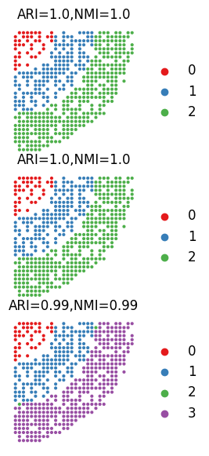

# Tutorial 1: Integrating three simulated slices by SMILE


```python
import warnings
warnings.filterwarnings('ignore')

import stSMILE
from stSMILE import SMILE
```

```python
import scanpy as sc
import anndata as ad
import scanpy.external as sce
import matplotlib.pyplot as plt
import numpy as np
import pandas as pd
import squidpy as sq
import scipy.sparse as sp
from scipy import sparse
from scipy.sparse import csr_matrix
import math
import torch
import torch.nn as nn
import time
import torch.nn.functional as F
from itertools import chain
from scanpy import read_10x_h5
import torch.optim as optim
import sklearn
from sklearn.neighbors import kneighbors_graph
import gudhi
import networkx as nx
from torch_geometric.nn import GCNConv
import random
import os
import json 
import matplotlib.image as mpimg
```

## Load data

```python
section_ids = ['S1','S2','S3']
```

```python
adata_l = []
for i in range(len(section_ids)):
    adata_i = sc.read_h5ad('./dataset/simulation/simulated_'+ section_ids[i]+'_ST_final.h5ad')
    adata_i.obs_names = [x+'_'+section_ids[i] for x in adata_i.obs_names]
    cluster = pd.read_csv('/./dataset/simulation/simulated_' + section_ids[i]+'_true_cluster.csv', sep = '\t')
    cluster.index = adata_i.obs_names
    adata_i.obs['Ground Truth'] = pd.Series(cluster['0'])    
    adata_i.obs['Ground Truth'] = adata_i.obs['Ground Truth'].astype(str)
    adata_i.obs['Ground Truth'] = adata_i.obs['Ground Truth'].astype('category')
    adata_l.append(adata_i)
```

```python
adata0_sc = sc.read_h5ad('./dataset/simulation/simulated_sc_final.h5ad') 
adata_l.append(adata0_sc)
```


## Run SMILE

```python
tag_l = ['ST','ST','ST','single cell']
in_features = len(adata_l[0].var.index)
hidden_features = 512
out_features = 50
feature_method = 'GCNConv'
alpha = 1
beta = 1
gamma = 1000
lamb = 1
theta = 0.9
spatial_regularization_strength= 0.9
lr=1e-3
subepochs=100
epochs=200
max_patience=50
min_stop=20
random_seed=2024
gpu=0
regularization_acceleration=True
edge_subset_sz=1000000
add_topology = True
add_feature = False
add_image = False
add_sc = True
multiscale = True
anchor_type = None
anchors_all = False
use_rep_anchor = 'deconvolution'
align_method = 'MMD'
anchor_size=8000
iter_comb= None
n_clusters_l = [4]
edge_weights = [1,0.1,0.1]
```


```python
adata_l = SMILE(adata_l, tag_l, section_ids, multiscale,  n_clusters_l, in_features, feature_method, hidden_features, out_features, iter_comb, anchors_all, use_rep_anchor, alpha, beta, lamb, theta, gamma,edge_weights, add_topology, add_feature, add_image, add_sc, spatial_regularization_strength, lr=0.001, subepochs=100, epochs=200,mnn_neigh = 5)
```

    Pretraining to extract embeddings of spots...
    epoch   0: train spatial C loss: 0.0000, train F loss: 4.8514,
    epoch  10: train spatial C loss: 0.0000, train F loss: 2.2220,
    epoch  20: train spatial C loss: 0.0000, train F loss: 1.4567,
    epoch  30: train spatial C loss: 0.0000, train F loss: 1.0723,
    epoch  40: train spatial C loss: 0.0000, train F loss: 0.8445,
    epoch  50: train spatial C loss: 0.0000, train F loss: 0.7221,
    epoch  60: train spatial C loss: 0.0000, train F loss: 0.6632,
    epoch  70: train spatial C loss: 0.0000, train F loss: 0.6334,
    epoch  80: train spatial C loss: 0.0000, train F loss: 0.5898,
    epoch  90: train spatial C loss: 0.0000, train F loss: 0.5745,
    Training classifier...
    Training classifier...
    epoch   0: overall loss: 37.6162,sc classifier loss: 1.9628,representation loss: 0.0356,within spatial regularization loss: 0.0980
    epoch  10: overall loss: 5.8596,sc classifier loss: 1.2574,representation loss: 0.0045,within spatial regularization loss: 0.0870
    epoch  20: overall loss: 3.7902,sc classifier loss: 1.1089,representation loss: 0.0026,within spatial regularization loss: 0.0981
    epoch  30: overall loss: 2.2469,sc classifier loss: 0.9047,representation loss: 0.0013,within spatial regularization loss: 0.0979
    epoch  40: overall loss: 1.4784,sc classifier loss: 0.6663,representation loss: 0.0007,within spatial regularization loss: 0.0974
    epoch  50: overall loss: 1.1395,sc classifier loss: 0.4817,representation loss: 0.0006,within spatial regularization loss: 0.0956
    epoch  60: overall loss: 1.0347,sc classifier loss: 0.3506,representation loss: 0.0006,within spatial regularization loss: 0.0947
    epoch  70: overall loss: 0.7265,sc classifier loss: 0.2630,representation loss: 0.0004,within spatial regularization loss: 0.0929
    epoch  80: overall loss: 0.6014,sc classifier loss: 0.1984,representation loss: 0.0003,within spatial regularization loss: 0.0926
    epoch  90: overall loss: 0.5602,sc classifier loss: 0.1562,representation loss: 0.0003,within spatial regularization loss: 0.0920
    epoch 100: overall loss: 0.4967,sc classifier loss: 0.1360,representation loss: 0.0003,within spatial regularization loss: 0.0920
    epoch 110: overall loss: 0.4817,sc classifier loss: 0.1155,representation loss: 0.0003,within spatial regularization loss: 0.0914
    epoch 120: overall loss: 0.4196,sc classifier loss: 0.1053,representation loss: 0.0002,within spatial regularization loss: 0.0910
    epoch 130: overall loss: 0.4143,sc classifier loss: 0.0923,representation loss: 0.0002,within spatial regularization loss: 0.0908
    epoch 140: overall loss: 0.4955,sc classifier loss: 0.0872,representation loss: 0.0003,within spatial regularization loss: 0.0911
    epoch 150: overall loss: 0.3505,sc classifier loss: 0.0793,representation loss: 0.0002,within spatial regularization loss: 0.0906
    epoch 160: overall loss: 0.3366,sc classifier loss: 0.0738,representation loss: 0.0002,within spatial regularization loss: 0.0898
    epoch 170: overall loss: 0.3546,sc classifier loss: 0.0694,representation loss: 0.0002,within spatial regularization loss: 0.0894
    epoch 180: overall loss: 0.4105,sc classifier loss: 0.0654,representation loss: 0.0003,within spatial regularization loss: 0.0897
    epoch 190: overall loss: 0.2838,sc classifier loss: 0.0628,representation loss: 0.0001,within spatial regularization loss: 0.0889
    single cell data classification: Avg Accuracy = 98.947370%


    R[write to console]:                    __           __ 
       ____ ___  _____/ /_  _______/ /_
      / __ `__ \/ ___/ / / / / ___/ __/
     / / / / / / /__/ / /_/ (__  ) /_  
    /_/ /_/ /_/\___/_/\__,_/____/\__/   version 6.1.1
    Type 'citation("mclust")' for citing this R package in publications.
    


    fitting ...
      |======================================================================| 100%
    Identifying anchors...
    Processing datasets (0, 1)
    Processing datasets (0, 2)
    Processing datasets (1, 2)
    0.9805634888254228
    The ratio of filtered mnn pairs: 1.0
    The ratio of filtered mnn pairs: 0.96
    The ratio of filtered mnn pairs: 0.9603803486529319
    Aligning by anchors...
    epoch 100: total loss:4.3614, train F loss: 1.3807, train C loss: 1.3639, train D loss: 2.9807
    epoch 110: total loss:1.1600, train F loss: 0.9650, train C loss: 0.3505, train D loss: 0.1950
    epoch 120: total loss:1.1445, train F loss: 1.0216, train C loss: 0.1893, train D loss: 0.1229
    epoch 130: total loss:0.7761, train F loss: 0.6795, train C loss: 0.0317, train D loss: 0.0966
    epoch 140: total loss:0.6860, train F loss: 0.6034, train C loss: 0.0109, train D loss: 0.0826
    epoch 150: total loss:0.6461, train F loss: 0.5806, train C loss: 0.0078, train D loss: 0.0656
    epoch 160: total loss:0.6199, train F loss: 0.5719, train C loss: 0.0089, train D loss: 0.0479
    epoch 170: total loss:0.6012, train F loss: 0.5684, train C loss: 0.0106, train D loss: 0.0328
    epoch 180: total loss:0.5889, train F loss: 0.5636, train C loss: 0.0097, train D loss: 0.0253
    epoch 190: total loss:0.5809, train F loss: 0.5577, train C loss: 0.0083, train D loss: 0.0232
    Updating classifier...
    Training classifier...
    epoch   0: overall loss: 43.2403,sc classifier loss: 2.0894,representation loss: 0.0411,within spatial regularization loss: 0.1055
    epoch  10: overall loss: 6.4191,sc classifier loss: 1.2766,representation loss: 0.0051,within spatial regularization loss: 0.0950
    epoch  20: overall loss: 4.9455,sc classifier loss: 1.0837,representation loss: 0.0038,within spatial regularization loss: 0.0946
    epoch  30: overall loss: 3.5694,sc classifier loss: 0.9264,representation loss: 0.0026,within spatial regularization loss: 0.0929
    epoch  40: overall loss: 2.2210,sc classifier loss: 0.7579,representation loss: 0.0014,within spatial regularization loss: 0.0943
    epoch  50: overall loss: 1.4686,sc classifier loss: 0.6345,representation loss: 0.0007,within spatial regularization loss: 0.0941
    epoch  60: overall loss: 1.0352,sc classifier loss: 0.5273,representation loss: 0.0004,within spatial regularization loss: 0.0928
    epoch  70: overall loss: 0.8816,sc classifier loss: 0.4237,representation loss: 0.0004,within spatial regularization loss: 0.0922
    epoch  80: overall loss: 0.7492,sc classifier loss: 0.3363,representation loss: 0.0003,within spatial regularization loss: 0.0918
    epoch  90: overall loss: 0.6912,sc classifier loss: 0.2751,representation loss: 0.0003,within spatial regularization loss: 0.0913
    epoch 100: overall loss: 0.7203,sc classifier loss: 0.2361,representation loss: 0.0004,within spatial regularization loss: 0.0908
    epoch 110: overall loss: 0.6237,sc classifier loss: 0.2100,representation loss: 0.0003,within spatial regularization loss: 0.0906
    epoch 120: overall loss: 0.6797,sc classifier loss: 0.1862,representation loss: 0.0004,within spatial regularization loss: 0.0909
    epoch 130: overall loss: 0.5683,sc classifier loss: 0.1653,representation loss: 0.0003,within spatial regularization loss: 0.0911
    epoch 140: overall loss: 0.4838,sc classifier loss: 0.1461,representation loss: 0.0003,within spatial regularization loss: 0.0903
    epoch 150: overall loss: 0.4287,sc classifier loss: 0.1301,representation loss: 0.0002,within spatial regularization loss: 0.0899
    epoch 160: overall loss: 0.4165,sc classifier loss: 0.1177,representation loss: 0.0002,within spatial regularization loss: 0.0899
    epoch 170: overall loss: 0.7066,sc classifier loss: 0.1077,representation loss: 0.0005,within spatial regularization loss: 0.0903
    epoch 180: overall loss: 0.4558,sc classifier loss: 0.0981,representation loss: 0.0003,within spatial regularization loss: 0.0903
    epoch 190: overall loss: 0.3739,sc classifier loss: 0.0892,representation loss: 0.0002,within spatial regularization loss: 0.0896
    single cell data classification: Avg Accuracy = 98.693955%


```python
adata_concat_st = ad.concat(adata_l[0:len(section_ids)], label="slice_name", keys=section_ids)
```


```python
adata_concat_st.obs['pd_cluster'] = adata_concat_st.obs['pd_cluster'].astype(str)
adata_concat_st.obs['pd_cluster'] = adata_concat_st.obs['pd_cluster'].astype('category')
```


```python
sc.tl.pca(adata_concat_st)
adata_concat_st.obsm['X_pca_old'] = adata_concat_st.obsm['X_pca'].copy()
adata_concat_st.obsm['X_pca'] = adata_concat_st.obsm['embedding'].copy()
sc.pp.neighbors(adata_concat_st)  
sc.tl.umap(adata_concat_st)
```

## Results and visualizations
```python
import matplotlib.pyplot as plt
from sklearn.metrics import adjusted_rand_score as ari_score
from sklearn.metrics import normalized_mutual_info_score as nmi_score
import seaborn as sns
rgb_values = sns.color_palette("Set1", len(adata_concat_st.obs['pd_cluster'].unique()))
color_fine = dict(zip(list(adata_concat_st.obs['pd_cluster'].unique()), rgb_values))
Batch_list = []
for section_id in section_ids:
    Batch_list.append(adata_concat_st[adata_concat_st.obs['slice_name'] == section_id])

spot_size = 0.8
title_size = 12
ARI_list = []
NMI_list = []
for bb in range(len(section_ids)):
    ARI_list.append(round(ari_score(Batch_list[bb].obs['Ground Truth'], Batch_list[bb].obs['pd_cluster']), 2))
    NMI_list.append(round(nmi_score(Batch_list[bb].obs['Ground Truth'], Batch_list[bb].obs['pd_cluster']), 2))

fig, ax = plt.subplots(3,1, figsize=(3.5,7), gridspec_kw={'wspace': 0.05, 'hspace': 0.1})
_sc_0 = sc.pl.spatial(Batch_list[0], img_key=None, color=['pd_cluster'], 
                      legend_loc='right margin', legend_fontsize=12, show=False, ax=ax[0], frameon=False,
                      spot_size=spot_size,palette = color_fine)
_sc_0[0].set_title("ARI=" + str(ARI_list[0])+",NMI=" + str(NMI_list[0]), size=title_size)
_sc_1 = sc.pl.spatial(Batch_list[1], img_key=None, color=['pd_cluster'], 
                      legend_loc='right margin', legend_fontsize=12, show=False, ax=ax[1], frameon=False,
                      spot_size=spot_size,palette = color_fine)
_sc_1[0].set_title("ARI=" + str(ARI_list[1])+",NMI=" + str(NMI_list[1]), size=title_size)

_sc_2 = sc.pl.spatial(Batch_list[2], img_key=None, color=['pd_cluster'], 
                      legend_loc='right margin', legend_fontsize=12, show=False, ax=ax[2], frameon=False,
                      spot_size=spot_size,palette = color_fine)
_sc_2[0].set_title("ARI=" + str(ARI_list[2])+",NMI=" + str(NMI_list[2]), size=title_size)

plt.savefig("simulated_spatial_SMILE.pdf") 
plt.show()
```


    

    

