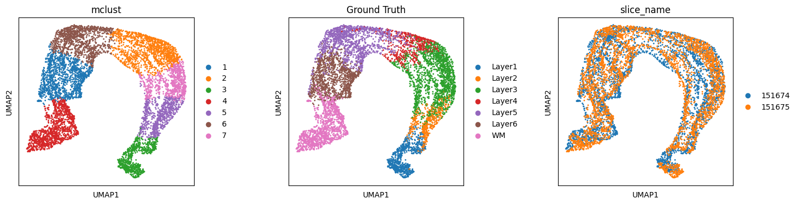
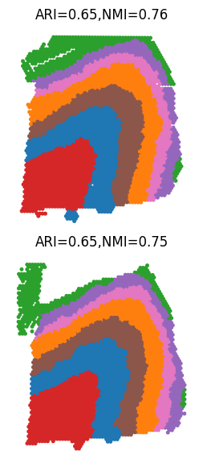

# Tutorial 2: Integrating adjacent DLPFC slices

This tutorial demonstrates SMILE's ablility to integrate two adjacent slices (151674 and 151675). The slices are sampled from human dorsolateral prefrontal cortex (DLPFC) and the processed data can be downloaded from <https://figshare.com/articles/dataset/DLPFC_slices_and_reference_scRNA-seq_data/27987548>


```python
import warnings
warnings.filterwarnings('ignore')
```

```python
from stSMILE import SMILE
```

```python
import scanpy as sc
import anndata as ad
import matplotlib.pyplot as plt
import numpy as np
import pandas as pd
import squidpy as sq
import scipy.sparse as sp
from scipy import sparse
from scipy.sparse import csr_matrix
import math
import torch
import torch.nn as nn
import time
import torch.nn.functional as F
from itertools import chain
from scanpy import read_10x_h5
import torch.optim as optim
import sklearn
from sklearn.neighbors import kneighbors_graph
import gudhi
import networkx as nx
from torch_geometric.nn import GCNConv
import random
import os
import json 
import matplotlib.image as mpimg
```

## Load data


```python
section_ids = ['151674','151675']
```


```python
def label_to_int(adataA, label_list, label_name):
    adata_label = np.array(adataA.obs[label_name].copy())
    for i in range(len(label_list)):
        need_index = np.where(adataA.obs[label_name]==label_list[i])[0]
        if len(need_index):
            adata_label[need_index] = i
    adataA.obs['ref'] = adata_label
    return adataA
```


```python
adata_l = []
for i in range(len(section_ids)):
    adata_i = sc.read_h5ad('./dataset/DLPFC/DLPFC_'+ section_ids[i]+'_ST_final.h5ad')
    adata_i.obs_names = [x+'_'+section_ids[i] for x in adata_i.obs_names]
    adata_l.append(adata_i)
```


```python
# convert label to int
label_list = ['Layer1', 'Layer2', 'Layer3', 'Layer4', 'Layer5', 'Layer6', 'WM']
```


```python
for i in range(len(section_ids)):
    adata_l[i] = label_to_int(adata_l[i], label_list, 'Ground Truth')
```


```python
adata0_sc = sc.read_h5ad('./dataset/DLPFC/DLPFC_sc_final.h5ad') 
```

```python
adata0_sc
```

    AnnData object with n_obs × n_vars = 19764 × 3010
        obs: 'orig.ident', 'nCount_RNA', 'nFeature_RNA', 'cell_type', 'cell_subtype', 'subject', 'condition', 'batch', 'n_genes', 'ref'
        var: 'features', 'n_cells', 'n_counts'
        uns: 'rank_genes_groups'
        obsm: 'X_pca'
        obsp: 'adj_f'


```python
label0_list = adata0_sc.obs['cell_subtype'].tolist()
adata0_label_new = adata0_sc.obs['cell_subtype'].tolist()
for i in range(len(label0_list)):
    need_index = np.where(adata0_sc.obs['cell_subtype'] == label0_list[i])[0]    
    if len(need_index):
        for p in range(len(need_index)):
            adata0_label_new[need_index[p]] = i  
```


```python
adata0_sc.obs['ref'] = pd.Series(adata0_label_new, index = adata0_sc.obs['cell_subtype'].index)
adata0_sc.obs['ref'] = adata0_sc.obs['ref'].astype(str)
adata0_sc.obs['ref'] = adata0_sc.obs['ref'].astype('category')
adata0_sc.obs['Ground Truth'] = adata0_sc.obs['cell_subtype']
```


```python
adata_l.append(adata0_sc)
```


## Run SMILE

```python
tag_l = ['ST','ST','single cell']
in_features = len(adata_l[0].var.index)
hidden_features = 512
out_features = 50
feature_method = 'GCNConv'
alpha = 0.001
beta = 1 
lamb = 0.01 
theta = 0.001 
gamma = 10 # reconstruct 
spatial_regularization_strength= 0.9
lr=1e-3
subepochs=100
epochs=200
max_patience=50
min_stop=20
random_seed=2024
gpu=0
regularization_acceleration=True
edge_subset_sz=1000000
add_topology = True
add_feature = False
add_image = False
add_sc = True
multiscale = True
anchor_type = None
anchors_all = False
use_rep_anchor = 'embedding'
align_method = 'MMD'
anchor_size=8000
iter_comb= None
n_clusters_l = [7]
edge_weights = [1,0.1,0.1]
class_rep = 'reconstruct'
```


```python
adata_l = SMILE(adata_l, tag_l, section_ids, multiscale,  n_clusters_l, in_features, feature_method, hidden_features, out_features, iter_comb, anchors_all, use_rep_anchor, alpha, beta, lamb, theta, gamma,edge_weights, add_topology, add_feature, add_image, add_sc, spatial_regularization_strength, lr=lr, subepochs=subepochs, epochs=epochs, class_rep = class_rep)
```

    Pretraining to extract embeddings of spots...
    epoch   0: train spatial C loss: 0.0000, train F loss: 38.8459,
    epoch  10: train spatial C loss: 0.0000, train F loss: 30.2219,
    epoch  20: train spatial C loss: 0.0000, train F loss: 24.9213,
    epoch  30: train spatial C loss: 0.0000, train F loss: 21.6007,
    epoch  40: train spatial C loss: 0.0000, train F loss: 19.4514,
    epoch  50: train spatial C loss: 0.0000, train F loss: 17.9709,
    epoch  60: train spatial C loss: 0.0000, train F loss: 16.9083,
    epoch  70: train spatial C loss: 0.0000, train F loss: 16.1047,
    epoch  80: train spatial C loss: 0.0000, train F loss: 15.4772,
    epoch  90: train spatial C loss: 0.0000, train F loss: 14.9738,
    Training classifier...
    Training classifier...
    torch.Size([3635, 33])
    torch.Size([3566, 33])
    epoch   0: overall loss: 9.7800,sc classifier loss: 3.4852,representation loss: 0.6295,within spatial regularization loss: 0.1034
    epoch  10: overall loss: 3.0628,sc classifier loss: 2.3038,representation loss: 0.0759,within spatial regularization loss: 0.0733
    epoch  20: overall loss: 2.3483,sc classifier loss: 1.7791,representation loss: 0.0569,within spatial regularization loss: 0.0701
    epoch  30: overall loss: 1.8954,sc classifier loss: 1.4075,representation loss: 0.0488,within spatial regularization loss: 0.0831
    epoch  40: overall loss: 1.6387,sc classifier loss: 1.1343,representation loss: 0.0504,within spatial regularization loss: 0.0895
    epoch  50: overall loss: 1.3759,sc classifier loss: 0.9372,representation loss: 0.0439,within spatial regularization loss: 0.0971
    epoch  60: overall loss: 1.2176,sc classifier loss: 0.7794,representation loss: 0.0438,within spatial regularization loss: 0.1009
    epoch  70: overall loss: 1.0668,sc classifier loss: 0.6563,representation loss: 0.0410,within spatial regularization loss: 0.1038
    epoch  80: overall loss: 0.9768,sc classifier loss: 0.5680,representation loss: 0.0409,within spatial regularization loss: 0.1038
    epoch  90: overall loss: 0.9203,sc classifier loss: 0.4987,representation loss: 0.0422,within spatial regularization loss: 0.1036
    epoch 100: overall loss: 0.9226,sc classifier loss: 0.4652,representation loss: 0.0457,within spatial regularization loss: 0.1002
    epoch 110: overall loss: 0.7858,sc classifier loss: 0.4259,representation loss: 0.0360,within spatial regularization loss: 0.1017
    epoch 120: overall loss: 0.7306,sc classifier loss: 0.3877,representation loss: 0.0343,within spatial regularization loss: 0.1026
    epoch 130: overall loss: 0.6970,sc classifier loss: 0.3601,representation loss: 0.0337,within spatial regularization loss: 0.1042
    epoch 140: overall loss: 0.6762,sc classifier loss: 0.3379,representation loss: 0.0338,within spatial regularization loss: 0.1038
    epoch 150: overall loss: 0.6491,sc classifier loss: 0.3167,representation loss: 0.0332,within spatial regularization loss: 0.1039
    epoch 160: overall loss: 0.7710,sc classifier loss: 0.3010,representation loss: 0.0470,within spatial regularization loss: 0.1060
    epoch 170: overall loss: 0.6684,sc classifier loss: 0.2958,representation loss: 0.0373,within spatial regularization loss: 0.1028
    epoch 180: overall loss: 0.6247,sc classifier loss: 0.2870,representation loss: 0.0338,within spatial regularization loss: 0.1033
    epoch 190: overall loss: 0.5935,sc classifier loss: 0.2696,representation loss: 0.0324,within spatial regularization loss: 0.1037
    single cell data classification: Avg Accuracy = 93.285769%


    R[write to console]:                    __           __ 
       ____ ___  _____/ /_  _______/ /_
      / __ `__ \/ ___/ / / / / ___/ __/
     / / / / / / /__/ / /_/ (__  ) /_  
    /_/ /_/ /_/\___/_/\__,_/____/\__/   version 6.1.1
    Type 'citation("mclust")' for citing this R package in publications.
    


    fitting ...
      |======================================================================| 100%
    Identifying anchors...
    Processing datasets (0, 1)
    0.8404312902226964
    The ratio of filtered mnn pairs: 0.8344709043272199
    Aligning by anchors...
    epoch 100: total loss:14.5462, train F loss: 14.5352, train C loss: 1.9671, train D loss: 0.0110
    epoch 110: total loss:14.1527, train F loss: 14.1463, train C loss: 0.2483, train D loss: 0.0064
    epoch 120: total loss:13.8135, train F loss: 13.8097, train C loss: 0.1978, train D loss: 0.0038
    epoch 130: total loss:13.4963, train F loss: 13.4930, train C loss: 0.1789, train D loss: 0.0033
    epoch 140: total loss:13.2162, train F loss: 13.2132, train C loss: 0.1657, train D loss: 0.0030
    epoch 150: total loss:12.9682, train F loss: 12.9651, train C loss: 0.1568, train D loss: 0.0031
    epoch 160: total loss:12.7516, train F loss: 12.7484, train C loss: 0.1465, train D loss: 0.0032
    epoch 170: total loss:12.5447, train F loss: 12.5414, train C loss: 0.1370, train D loss: 0.0033
    epoch 180: total loss:12.3810, train F loss: 12.3776, train C loss: 0.1306, train D loss: 0.0034
    epoch 190: total loss:12.2336, train F loss: 12.2299, train C loss: 0.1184, train D loss: 0.0037
    Updating classifier...
    Training classifier...
    epoch   0: overall loss: 15.3325,sc classifier loss: 3.6168,representation loss: 1.1716,within spatial regularization loss: 0.0920
    epoch  10: overall loss: 4.0092,sc classifier loss: 2.3635,representation loss: 0.1646,within spatial regularization loss: 0.0674
    epoch  20: overall loss: 2.6625,sc classifier loss: 1.7217,representation loss: 0.0941,within spatial regularization loss: 0.0751
    epoch  30: overall loss: 2.1796,sc classifier loss: 1.4069,representation loss: 0.0773,within spatial regularization loss: 0.0793
    epoch  40: overall loss: 1.8206,sc classifier loss: 1.1344,representation loss: 0.0686,within spatial regularization loss: 0.0856
    epoch  50: overall loss: 1.7814,sc classifier loss: 0.9472,representation loss: 0.0834,within spatial regularization loss: 0.0881
    epoch  60: overall loss: 1.5276,sc classifier loss: 0.8288,representation loss: 0.0699,within spatial regularization loss: 0.0913
    torch.Size([3566, 33])
    epoch  70: overall loss: 1.3631,sc classifier loss: 0.7348,representation loss: 0.0628,within spatial regularization loss: 0.0893
    epoch  80: overall loss: 1.2525,sc classifier loss: 0.6434,representation loss: 0.0609,within spatial regularization loss: 0.0918
    epoch  90: overall loss: 1.1642,sc classifier loss: 0.5708,representation loss: 0.0593,within spatial regularization loss: 0.0922
    epoch 100: overall loss: 1.0934,sc classifier loss: 0.5081,representation loss: 0.0585,within spatial regularization loss: 0.0927
    epoch 110: overall loss: 1.0984,sc classifier loss: 0.4562,representation loss: 0.0642,within spatial regularization loss: 0.0939
    epoch 120: overall loss: 1.3328,sc classifier loss: 0.4796,representation loss: 0.0853,within spatial regularization loss: 0.0908
    epoch 130: overall loss: 1.0778,sc classifier loss: 0.4287,representation loss: 0.0649,within spatial regularization loss: 0.0942
    epoch 140: overall loss: 0.9877,sc classifier loss: 0.3938,representation loss: 0.0594,within spatial regularization loss: 0.0913
    epoch 150: overall loss: 0.9437,sc classifier loss: 0.3653,representation loss: 0.0578,within spatial regularization loss: 0.0915
    epoch 160: overall loss: 0.9127,sc classifier loss: 0.3393,representation loss: 0.0573,within spatial regularization loss: 0.0939
    epoch 170: overall loss: 0.8826,sc classifier loss: 0.3186,representation loss: 0.0564,within spatial regularization loss: 0.0941
    epoch 180: overall loss: 0.8607,sc classifier loss: 0.3001,representation loss: 0.0560,within spatial regularization loss: 0.0942
    epoch 190: overall loss: 0.8425,sc classifier loss: 0.2846,representation loss: 0.0558,within spatial regularization loss: 0.0946
    single cell data classification: Avg Accuracy = 92.724144%


```python
adata_concat_st = ad.concat(adata_l[0:len(section_ids)], label="slice_name", keys=section_ids)
```


```python
sc.tl.pca(adata_concat_st)
adata_concat_st.obsm['X_pca_old'] = adata_concat_st.obsm['X_pca'].copy()
adata_concat_st.obsm['X_pca'] = adata_concat_st.obsm['embedding'].copy()
sc.pp.neighbors(adata_concat_st)  
sc.tl.umap(adata_concat_st)
```


```python
sc.tl.leiden(adata_concat_st, random_state=666, key_added="leiden", resolution=0.18)
len(list(set(adata_concat_st.obs['leiden'].tolist())))
```


    7


## Results and visualizations
```python
from stSMILE import analysis
analysis.mclust_R(adata_concat_st, num_cluster=7, used_obsm="embedding")
```

    fitting ...
      |======================================================================| 100%


    AnnData object with n_obs × n_vars = 7201 × 3010
        obs: 'in_tissue', 'array_row', 'array_col', 'Ground Truth', 'n_genes', 'image_cluster', 'dbscan_cluster_new', 'ref', 'pd_cluster', 'slice_name', 'leiden', 'mclust'
        uns: 'pca', 'neighbors', 'umap', 'leiden'
        obsm: 'X_pca', 'features', 'features_summary_scale0.5_0.5', 'features_summary_scale0.5_1', 'features_summary_scale0.5_2', 'features_summary_scale1_0.5', 'features_summary_scale1_1', 'features_summary_scale1_2', 'features_summary_scale2_0.5', 'features_summary_scale2_1', 'features_summary_scale2_2', 'spatial', 'embedding', 'hidden_spatial', 'reconstruct', 'deconvolution', 'X_pca_old', 'X_umap'
        varm: 'PCs'
        obsp: 'distances', 'connectivities'


```python
plt.rcParams["figure.figsize"] = (4, 4)
sc.pl.umap(adata_concat_st,color=["mclust",'Ground Truth',"slice_name"], wspace=0.4, save = 'DLPFC_umap_cluster_SMILE.pdf')  
```

    WARNING: saving figure to file figures/umapDLPFC_umap_cluster_SMILE.pdf


    

    


## Results and visualizations
```python
import matplotlib.pyplot as plt
from sklearn.metrics import adjusted_rand_score as ari_score
from sklearn.metrics import normalized_mutual_info_score as nmi_score
# split to each data
Batch_list = []
for section_id in section_ids:
    Batch_list.append(adata_concat_st[adata_concat_st.obs['slice_name'] == section_id])

spot_size = 200
title_size = 12
ARI_list = []
NMI_list = []
for bb in range(len(section_ids)):
    ARI_list.append(round(ari_score(Batch_list[bb].obs['Ground Truth'], Batch_list[bb].obs['mclust']), 2))
    NMI_list.append(round(nmi_score(Batch_list[bb].obs['Ground Truth'], Batch_list[bb].obs['mclust']), 2))

fig, ax = plt.subplots(2, 1, figsize=(3.5, 7), gridspec_kw={'wspace': 0.05, 'hspace': 0.1})
_sc_0 = sc.pl.spatial(Batch_list[0], img_key=None, color=['mclust'], title=[''],
                      legend_loc=None, legend_fontsize=12, show=False, ax=ax[0], frameon=False,
                      spot_size=spot_size)
_sc_0[0].set_title("ARI=" + str(ARI_list[0])+",NMI=" + str(NMI_list[0]), size=title_size)
_sc_1 = sc.pl.spatial(Batch_list[1], img_key=None, color=['mclust'], title=[''],
                      legend_loc=None, legend_fontsize=12, show=False, ax=ax[1], frameon=False,
                      spot_size=spot_size)
_sc_1[0].set_title("ARI=" + str(ARI_list[1])+",NMI=" + str(NMI_list[1]), size=title_size)
plt.savefig("DLPFC_spatial_SMILE.pdf") 
plt.show()
```


    

    


```python
adata_l[0].uns['deconvolution']
```


<div>
<style scoped>
    .dataframe tbody tr th:only-of-type {
        vertical-align: middle;
    }

    .dataframe tbody tr th {
        vertical-align: top;
    }

    .dataframe thead th {
        text-align: right;
    }
</style>
<table border="1" class="dataframe">
  <thead>
    <tr style="text-align: right;">
      <th></th>
      <th>AAACAAGTATCTCCCA-1_151674_151674</th>
      <th>AAACAATCTACTAGCA-1_151674_151674</th>
      <th>AAACACCAATAACTGC-1_151674_151674</th>
      <th>AAACAGAGCGACTCCT-1_151674_151674</th>
      <th>AAACAGCTTTCAGAAG-1_151674_151674</th>
      <th>AAACAGGGTCTATATT-1_151674_151674</th>
      <th>AAACAGTGTTCCTGGG-1_151674_151674</th>
      <th>AAACATTTCCCGGATT-1_151674_151674</th>
      <th>AAACCCGAACGAAATC-1_151674_151674</th>
      <th>AAACCGGGTAGGTACC-1_151674_151674</th>
      <th>...</th>
      <th>TTGTGTATGCCACCAA-1_151674_151674</th>
      <th>TTGTGTTTCCCGAAAG-1_151674_151674</th>
      <th>TTGTTAGCAAATTCGA-1_151674_151674</th>
      <th>TTGTTCAGTGTGCTAC-1_151674_151674</th>
      <th>TTGTTGTGTGTCAAGA-1_151674_151674</th>
      <th>TTGTTTCACATCCAGG-1_151674_151674</th>
      <th>TTGTTTCATTAGTCTA-1_151674_151674</th>
      <th>TTGTTTCCATACAACT-1_151674_151674</th>
      <th>TTGTTTGTATTACACG-1_151674_151674</th>
      <th>TTGTTTGTGTAAATTC-1_151674_151674</th>
    </tr>
  </thead>
  <tbody>
    <tr>
      <th>Ex_3_L4_5</th>
      <td>6.969129e-03</td>
      <td>6.174900e-04</td>
      <td>1.027352e-08</td>
      <td>2.907331e-02</td>
      <td>1.151733e-01</td>
      <td>2.179292e-01</td>
      <td>6.726495e-05</td>
      <td>1.173180e-02</td>
      <td>3.489990e-03</td>
      <td>6.216561e-01</td>
      <td>...</td>
      <td>1.107924e-02</td>
      <td>3.292672e-03</td>
      <td>1.327825e-01</td>
      <td>3.654320e-01</td>
      <td>7.285582e-01</td>
      <td>2.056747e-07</td>
      <td>7.804774e-08</td>
      <td>1.532008e-02</td>
      <td>6.899436e-05</td>
      <td>3.995313e-06</td>
    </tr>
    <tr>
      <th>Mix_2</th>
      <td>1.144664e-07</td>
      <td>3.622714e-07</td>
      <td>1.838581e-06</td>
      <td>7.544602e-08</td>
      <td>3.360677e-01</td>
      <td>1.030835e-03</td>
      <td>1.469804e-04</td>
      <td>9.631843e-07</td>
      <td>9.051941e-10</td>
      <td>6.517683e-04</td>
      <td>...</td>
      <td>2.440290e-04</td>
      <td>4.984937e-04</td>
      <td>4.404069e-06</td>
      <td>3.596538e-03</td>
      <td>1.487128e-03</td>
      <td>2.864074e-05</td>
      <td>9.462240e-06</td>
      <td>1.683173e-02</td>
      <td>6.111187e-05</td>
      <td>2.503635e-09</td>
    </tr>
    <tr>
      <th>Astros_3</th>
      <td>7.542109e-13</td>
      <td>4.976497e-09</td>
      <td>3.281698e-05</td>
      <td>5.876007e-13</td>
      <td>1.142282e-05</td>
      <td>2.532608e-05</td>
      <td>1.662139e-04</td>
      <td>5.499309e-12</td>
      <td>1.104752e-12</td>
      <td>7.876854e-08</td>
      <td>...</td>
      <td>1.222819e-04</td>
      <td>8.953258e-04</td>
      <td>9.232067e-12</td>
      <td>1.188053e-08</td>
      <td>1.772218e-08</td>
      <td>2.183260e-03</td>
      <td>3.123484e-04</td>
      <td>6.731632e-03</td>
      <td>1.586484e-05</td>
      <td>9.812313e-09</td>
    </tr>
    <tr>
      <th>Inhib_5</th>
      <td>2.599940e-05</td>
      <td>3.712677e-06</td>
      <td>4.739135e-07</td>
      <td>2.806954e-06</td>
      <td>1.215782e-05</td>
      <td>2.259663e-07</td>
      <td>1.252311e-05</td>
      <td>1.007999e-03</td>
      <td>2.926604e-09</td>
      <td>2.613846e-09</td>
      <td>...</td>
      <td>3.426004e-07</td>
      <td>2.554535e-06</td>
      <td>1.385688e-04</td>
      <td>9.882564e-07</td>
      <td>2.053443e-07</td>
      <td>3.610777e-06</td>
      <td>2.119538e-06</td>
      <td>4.931921e-05</td>
      <td>3.495906e-06</td>
      <td>5.199091e-08</td>
    </tr>
    <tr>
      <th>Oligos_2</th>
      <td>3.322113e-10</td>
      <td>6.356483e-09</td>
      <td>3.128458e-01</td>
      <td>1.226389e-10</td>
      <td>3.514589e-06</td>
      <td>1.537011e-06</td>
      <td>2.353112e-03</td>
      <td>1.832942e-09</td>
      <td>9.932827e-12</td>
      <td>1.220030e-08</td>
      <td>...</td>
      <td>8.208621e-06</td>
      <td>1.067566e-04</td>
      <td>1.000387e-09</td>
      <td>3.041905e-08</td>
      <td>2.118467e-08</td>
      <td>4.344048e-01</td>
      <td>3.445954e-01</td>
      <td>9.848450e-04</td>
      <td>3.311624e-04</td>
      <td>8.219440e-10</td>
    </tr>
    <tr>
      <th>OPCs_1</th>
      <td>2.303407e-08</td>
      <td>6.548941e-07</td>
      <td>1.453799e-05</td>
      <td>1.375264e-08</td>
      <td>5.889276e-06</td>
      <td>3.458549e-05</td>
      <td>1.181179e-04</td>
      <td>1.105657e-08</td>
      <td>2.375208e-06</td>
      <td>9.104296e-07</td>
      <td>...</td>
      <td>2.467473e-04</td>
      <td>1.040747e-03</td>
      <td>6.711546e-09</td>
      <td>7.872727e-07</td>
      <td>2.454133e-06</td>
      <td>1.097253e-03</td>
      <td>6.136653e-05</td>
      <td>3.437947e-03</td>
      <td>2.492627e-05</td>
      <td>2.216885e-03</td>
    </tr>
    <tr>
      <th>Mix_5</th>
      <td>7.022922e-02</td>
      <td>2.340805e-05</td>
      <td>2.529608e-05</td>
      <td>5.073861e-02</td>
      <td>4.253091e-03</td>
      <td>1.422330e-04</td>
      <td>1.955855e-04</td>
      <td>3.317325e-02</td>
      <td>1.347937e-03</td>
      <td>3.805917e-05</td>
      <td>...</td>
      <td>3.302010e-05</td>
      <td>1.225939e-04</td>
      <td>1.175446e-03</td>
      <td>1.850879e-02</td>
      <td>2.356324e-02</td>
      <td>1.551443e-04</td>
      <td>6.335450e-05</td>
      <td>7.949749e-04</td>
      <td>6.539816e-05</td>
      <td>3.841993e-05</td>
    </tr>
    <tr>
      <th>Inhib_6_SST</th>
      <td>3.809572e-05</td>
      <td>7.408547e-11</td>
      <td>4.430857e-07</td>
      <td>1.531785e-05</td>
      <td>1.065465e-05</td>
      <td>4.851082e-08</td>
      <td>8.072549e-07</td>
      <td>2.037239e-05</td>
      <td>5.269946e-08</td>
      <td>2.654861e-09</td>
      <td>...</td>
      <td>7.926588e-09</td>
      <td>5.665231e-08</td>
      <td>2.914060e-05</td>
      <td>1.695641e-02</td>
      <td>1.828895e-02</td>
      <td>4.030802e-06</td>
      <td>1.114944e-06</td>
      <td>2.130349e-06</td>
      <td>2.774746e-08</td>
      <td>8.693223e-10</td>
    </tr>
    <tr>
      <th>Oligos_1</th>
      <td>4.715230e-10</td>
      <td>1.093477e-08</td>
      <td>6.251897e-01</td>
      <td>2.400796e-10</td>
      <td>3.440437e-06</td>
      <td>9.618647e-06</td>
      <td>1.489260e-01</td>
      <td>1.626619e-09</td>
      <td>3.958604e-11</td>
      <td>9.314818e-08</td>
      <td>...</td>
      <td>8.908093e-05</td>
      <td>6.741536e-04</td>
      <td>2.843505e-10</td>
      <td>3.177034e-09</td>
      <td>3.359012e-09</td>
      <td>4.213376e-01</td>
      <td>5.292145e-01</td>
      <td>1.707045e-03</td>
      <td>9.126685e-02</td>
      <td>4.159424e-10</td>
    </tr>
    <tr>
      <th>Mix_1</th>
      <td>9.387812e-09</td>
      <td>2.771037e-09</td>
      <td>8.217115e-07</td>
      <td>6.523106e-09</td>
      <td>1.420885e-01</td>
      <td>8.507208e-04</td>
      <td>5.206808e-04</td>
      <td>5.062454e-08</td>
      <td>4.212891e-11</td>
      <td>1.321318e-04</td>
      <td>...</td>
      <td>9.792802e-05</td>
      <td>3.395937e-04</td>
      <td>2.503545e-08</td>
      <td>2.687180e-05</td>
      <td>2.250277e-05</td>
      <td>3.613956e-06</td>
      <td>4.228411e-06</td>
      <td>5.304500e-03</td>
      <td>3.774091e-04</td>
      <td>6.675904e-12</td>
    </tr>
    <tr>
      <th>Inhib_3_SST</th>
      <td>3.131800e-08</td>
      <td>7.564521e-03</td>
      <td>2.282922e-08</td>
      <td>1.990833e-08</td>
      <td>9.484770e-07</td>
      <td>2.559283e-06</td>
      <td>2.982678e-06</td>
      <td>1.011834e-07</td>
      <td>2.429055e-07</td>
      <td>6.606045e-08</td>
      <td>...</td>
      <td>1.448983e-05</td>
      <td>2.983885e-05</td>
      <td>1.183360e-08</td>
      <td>2.508879e-08</td>
      <td>2.951299e-08</td>
      <td>1.085739e-07</td>
      <td>7.110510e-08</td>
      <td>1.427447e-04</td>
      <td>8.025528e-07</td>
      <td>3.331172e-02</td>
    </tr>
    <tr>
      <th>Ex_6_L4_6</th>
      <td>1.106280e-07</td>
      <td>1.275956e-06</td>
      <td>2.031759e-08</td>
      <td>7.696657e-08</td>
      <td>2.844928e-04</td>
      <td>3.237899e-05</td>
      <td>1.330352e-04</td>
      <td>2.941007e-06</td>
      <td>4.668109e-09</td>
      <td>9.684834e-06</td>
      <td>...</td>
      <td>1.194815e-04</td>
      <td>2.546169e-04</td>
      <td>8.810264e-03</td>
      <td>2.770237e-03</td>
      <td>3.959417e-03</td>
      <td>5.334537e-07</td>
      <td>2.031766e-07</td>
      <td>1.943589e-03</td>
      <td>1.828023e-04</td>
      <td>2.783026e-09</td>
    </tr>
    <tr>
      <th>Ex_7_L4_6</th>
      <td>4.053102e-09</td>
      <td>7.869427e-10</td>
      <td>5.796662e-07</td>
      <td>2.719557e-09</td>
      <td>1.915012e-03</td>
      <td>8.098045e-04</td>
      <td>5.627084e-03</td>
      <td>4.114865e-09</td>
      <td>1.764348e-09</td>
      <td>4.648007e-05</td>
      <td>...</td>
      <td>9.406718e-04</td>
      <td>9.037836e-03</td>
      <td>7.309504e-09</td>
      <td>3.190497e-03</td>
      <td>4.209323e-02</td>
      <td>1.141165e-05</td>
      <td>9.423859e-06</td>
      <td>4.144669e-03</td>
      <td>5.858894e-03</td>
      <td>3.305049e-10</td>
    </tr>
    <tr>
      <th>Ex_4_L_6</th>
      <td>3.172382e-07</td>
      <td>6.770508e-07</td>
      <td>8.324937e-08</td>
      <td>6.476919e-07</td>
      <td>1.925441e-01</td>
      <td>2.307862e-01</td>
      <td>6.572544e-05</td>
      <td>3.285137e-07</td>
      <td>3.514043e-07</td>
      <td>2.850848e-01</td>
      <td>...</td>
      <td>1.186501e-02</td>
      <td>5.878960e-03</td>
      <td>1.668930e-07</td>
      <td>9.200487e-04</td>
      <td>4.525761e-03</td>
      <td>1.131073e-06</td>
      <td>4.306189e-07</td>
      <td>4.911749e-02</td>
      <td>2.096841e-05</td>
      <td>5.733975e-08</td>
    </tr>
    <tr>
      <th>Mix_4</th>
      <td>5.353738e-06</td>
      <td>6.300014e-05</td>
      <td>4.285703e-06</td>
      <td>6.457186e-06</td>
      <td>2.401002e-02</td>
      <td>3.462924e-04</td>
      <td>1.090475e-05</td>
      <td>1.166674e-05</td>
      <td>6.393877e-07</td>
      <td>5.348081e-04</td>
      <td>...</td>
      <td>6.903738e-05</td>
      <td>8.091881e-05</td>
      <td>5.745594e-06</td>
      <td>1.284958e-03</td>
      <td>1.178578e-03</td>
      <td>4.821973e-05</td>
      <td>8.093351e-06</td>
      <td>3.979215e-03</td>
      <td>1.448414e-06</td>
      <td>4.277290e-05</td>
    </tr>
    <tr>
      <th>Inhib_2_VIP</th>
      <td>4.527714e-06</td>
      <td>1.354578e-05</td>
      <td>9.197858e-08</td>
      <td>1.842564e-06</td>
      <td>1.427521e-06</td>
      <td>1.365741e-06</td>
      <td>1.066277e-06</td>
      <td>7.445340e-05</td>
      <td>9.446614e-08</td>
      <td>4.357029e-08</td>
      <td>...</td>
      <td>2.420397e-06</td>
      <td>5.483661e-06</td>
      <td>1.623088e-04</td>
      <td>2.007017e-06</td>
      <td>1.137843e-06</td>
      <td>3.662107e-07</td>
      <td>1.509226e-07</td>
      <td>8.139470e-05</td>
      <td>9.484784e-08</td>
      <td>6.822607e-05</td>
    </tr>
    <tr>
      <th>Astros_2</th>
      <td>1.761832e-06</td>
      <td>6.635826e-05</td>
      <td>3.024704e-05</td>
      <td>1.313114e-06</td>
      <td>8.566742e-05</td>
      <td>2.368000e-06</td>
      <td>2.970858e-05</td>
      <td>2.334632e-06</td>
      <td>2.129988e-06</td>
      <td>8.542484e-08</td>
      <td>...</td>
      <td>6.076156e-06</td>
      <td>2.831762e-05</td>
      <td>2.195614e-07</td>
      <td>4.711030e-06</td>
      <td>2.515737e-06</td>
      <td>1.217556e-03</td>
      <td>1.001168e-04</td>
      <td>8.825109e-04</td>
      <td>3.072990e-06</td>
      <td>1.842220e-03</td>
    </tr>
    <tr>
      <th>Astros_1</th>
      <td>1.201523e-12</td>
      <td>1.953085e-09</td>
      <td>1.224096e-03</td>
      <td>6.766249e-13</td>
      <td>1.439081e-04</td>
      <td>5.914796e-05</td>
      <td>1.077180e-03</td>
      <td>1.619942e-11</td>
      <td>5.432529e-14</td>
      <td>3.611861e-07</td>
      <td>...</td>
      <td>1.348757e-04</td>
      <td>8.616096e-04</td>
      <td>5.370073e-12</td>
      <td>4.659470e-09</td>
      <td>3.766855e-09</td>
      <td>4.241443e-03</td>
      <td>3.825556e-03</td>
      <td>9.002970e-03</td>
      <td>1.639025e-04</td>
      <td>9.392908e-11</td>
    </tr>
    <tr>
      <th>Ex_2_L5</th>
      <td>5.746522e-06</td>
      <td>4.701679e-09</td>
      <td>6.476725e-08</td>
      <td>5.760590e-06</td>
      <td>1.292586e-02</td>
      <td>1.810356e-04</td>
      <td>1.060314e-05</td>
      <td>3.284260e-05</td>
      <td>1.765196e-09</td>
      <td>1.468756e-04</td>
      <td>...</td>
      <td>1.546418e-06</td>
      <td>3.254646e-06</td>
      <td>5.624586e-06</td>
      <td>1.273811e-04</td>
      <td>1.186338e-04</td>
      <td>2.141313e-07</td>
      <td>1.801047e-07</td>
      <td>4.797298e-05</td>
      <td>3.701893e-06</td>
      <td>4.880471e-12</td>
    </tr>
    <tr>
      <th>OPCs_2</th>
      <td>1.126917e-13</td>
      <td>4.612336e-11</td>
      <td>1.095641e-04</td>
      <td>2.999705e-14</td>
      <td>1.826984e-08</td>
      <td>7.478603e-08</td>
      <td>1.748297e-05</td>
      <td>8.929763e-13</td>
      <td>1.642399e-13</td>
      <td>1.425015e-10</td>
      <td>...</td>
      <td>1.583036e-06</td>
      <td>2.288817e-05</td>
      <td>8.515883e-13</td>
      <td>1.005902e-10</td>
      <td>1.236756e-10</td>
      <td>1.836568e-02</td>
      <td>5.616478e-04</td>
      <td>2.700382e-04</td>
      <td>1.055998e-06</td>
      <td>1.909537e-08</td>
    </tr>
    <tr>
      <th>Ex_8_L5_6</th>
      <td>5.428657e-10</td>
      <td>5.606627e-08</td>
      <td>2.110268e-04</td>
      <td>5.391343e-10</td>
      <td>2.839633e-02</td>
      <td>3.337331e-01</td>
      <td>2.525081e-01</td>
      <td>2.868516e-09</td>
      <td>1.863032e-10</td>
      <td>7.810751e-02</td>
      <td>...</td>
      <td>3.863671e-01</td>
      <td>4.729090e-01</td>
      <td>3.613515e-09</td>
      <td>4.788989e-06</td>
      <td>1.689251e-05</td>
      <td>3.078576e-03</td>
      <td>1.293664e-03</td>
      <td>4.766280e-01</td>
      <td>4.005852e-01</td>
      <td>2.234830e-09</td>
    </tr>
    <tr>
      <th>Inhib_1</th>
      <td>1.470631e-06</td>
      <td>3.972175e-07</td>
      <td>3.982941e-06</td>
      <td>1.133233e-06</td>
      <td>2.783863e-06</td>
      <td>3.230669e-09</td>
      <td>6.162509e-09</td>
      <td>1.660090e-06</td>
      <td>2.271773e-08</td>
      <td>6.102157e-10</td>
      <td>...</td>
      <td>3.125852e-10</td>
      <td>1.509004e-09</td>
      <td>4.700690e-07</td>
      <td>4.685031e-04</td>
      <td>2.209392e-04</td>
      <td>1.621055e-05</td>
      <td>2.386047e-06</td>
      <td>4.400691e-07</td>
      <td>4.863112e-11</td>
      <td>8.454985e-07</td>
    </tr>
    <tr>
      <th>Ex_9_L5_6</th>
      <td>4.922706e-06</td>
      <td>4.455678e-07</td>
      <td>1.986375e-08</td>
      <td>7.068288e-06</td>
      <td>2.335303e-04</td>
      <td>1.414419e-04</td>
      <td>7.026473e-05</td>
      <td>2.542575e-06</td>
      <td>7.744870e-06</td>
      <td>3.626575e-05</td>
      <td>...</td>
      <td>2.523793e-05</td>
      <td>4.216139e-05</td>
      <td>4.067813e-07</td>
      <td>1.640185e-04</td>
      <td>5.512940e-04</td>
      <td>2.137241e-07</td>
      <td>1.032411e-07</td>
      <td>1.253849e-04</td>
      <td>3.691699e-05</td>
      <td>7.113815e-08</td>
    </tr>
    <tr>
      <th>Inhib_8_PVALB</th>
      <td>3.969033e-04</td>
      <td>5.369036e-01</td>
      <td>2.649109e-08</td>
      <td>2.762289e-04</td>
      <td>2.431192e-04</td>
      <td>8.852249e-05</td>
      <td>3.312487e-05</td>
      <td>2.703326e-03</td>
      <td>1.099732e-04</td>
      <td>6.824694e-06</td>
      <td>...</td>
      <td>1.061196e-04</td>
      <td>1.624674e-04</td>
      <td>5.408885e-04</td>
      <td>2.668971e-05</td>
      <td>1.144796e-05</td>
      <td>2.943015e-07</td>
      <td>1.686579e-07</td>
      <td>8.204745e-04</td>
      <td>3.351401e-05</td>
      <td>9.823893e-02</td>
    </tr>
    <tr>
      <th>Inhib_4_SST</th>
      <td>5.559318e-08</td>
      <td>8.254041e-07</td>
      <td>1.008312e-08</td>
      <td>2.059556e-08</td>
      <td>1.948467e-05</td>
      <td>1.998858e-07</td>
      <td>9.184345e-07</td>
      <td>5.318890e-07</td>
      <td>2.553563e-10</td>
      <td>4.052869e-09</td>
      <td>...</td>
      <td>7.159372e-08</td>
      <td>3.145651e-07</td>
      <td>2.685139e-07</td>
      <td>1.506060e-05</td>
      <td>5.135757e-06</td>
      <td>4.504801e-08</td>
      <td>4.374684e-08</td>
      <td>1.086342e-05</td>
      <td>1.489151e-07</td>
      <td>5.204655e-09</td>
    </tr>
    <tr>
      <th>Inhib_7_PVALB</th>
      <td>3.771151e-03</td>
      <td>7.065056e-06</td>
      <td>1.021373e-08</td>
      <td>2.133727e-03</td>
      <td>1.390819e-02</td>
      <td>5.751749e-05</td>
      <td>5.128600e-06</td>
      <td>5.476939e-02</td>
      <td>1.131040e-06</td>
      <td>1.483429e-05</td>
      <td>...</td>
      <td>4.211597e-06</td>
      <td>8.107341e-06</td>
      <td>4.601649e-01</td>
      <td>4.292178e-01</td>
      <td>1.164777e-01</td>
      <td>1.293240e-07</td>
      <td>6.188822e-08</td>
      <td>1.499547e-04</td>
      <td>2.128651e-06</td>
      <td>2.483982e-08</td>
    </tr>
    <tr>
      <th>Mix_3</th>
      <td>2.188812e-01</td>
      <td>1.726181e-01</td>
      <td>5.891335e-08</td>
      <td>2.591775e-01</td>
      <td>5.028176e-03</td>
      <td>2.073113e-04</td>
      <td>6.476233e-05</td>
      <td>2.764076e-01</td>
      <td>2.085457e-01</td>
      <td>1.972519e-05</td>
      <td>...</td>
      <td>1.438308e-04</td>
      <td>2.416857e-04</td>
      <td>1.978173e-01</td>
      <td>1.488124e-01</td>
      <td>4.449908e-02</td>
      <td>8.786663e-07</td>
      <td>3.849669e-07</td>
      <td>9.569440e-04</td>
      <td>7.206837e-05</td>
      <td>1.072768e-01</td>
    </tr>
    <tr>
      <th>Ex_1_L5_6</th>
      <td>2.024828e-12</td>
      <td>1.926577e-11</td>
      <td>1.444598e-05</td>
      <td>9.708949e-13</td>
      <td>7.182638e-02</td>
      <td>9.340792e-04</td>
      <td>2.515586e-04</td>
      <td>1.367040e-11</td>
      <td>7.509047e-14</td>
      <td>2.161433e-05</td>
      <td>...</td>
      <td>1.625330e-03</td>
      <td>7.510009e-03</td>
      <td>3.580937e-10</td>
      <td>1.984929e-03</td>
      <td>5.716261e-03</td>
      <td>2.537716e-03</td>
      <td>1.905493e-04</td>
      <td>5.232777e-02</td>
      <td>4.012349e-05</td>
      <td>5.512795e-12</td>
    </tr>
    <tr>
      <th>Micro/Macro</th>
      <td>1.864344e-06</td>
      <td>1.119673e-04</td>
      <td>6.629099e-04</td>
      <td>1.160585e-06</td>
      <td>3.573515e-04</td>
      <td>4.381800e-05</td>
      <td>7.142534e-04</td>
      <td>1.913180e-05</td>
      <td>1.023166e-08</td>
      <td>1.224546e-05</td>
      <td>...</td>
      <td>4.084556e-05</td>
      <td>4.492511e-05</td>
      <td>1.863973e-05</td>
      <td>4.098184e-07</td>
      <td>1.267596e-07</td>
      <td>1.708352e-04</td>
      <td>3.516524e-04</td>
      <td>2.055096e-03</td>
      <td>1.912791e-04</td>
      <td>1.434237e-07</td>
    </tr>
    <tr>
      <th>Oligos_3</th>
      <td>3.709469e-08</td>
      <td>7.122149e-07</td>
      <td>1.181898e-03</td>
      <td>2.290434e-08</td>
      <td>5.436231e-05</td>
      <td>1.418966e-05</td>
      <td>8.566926e-03</td>
      <td>7.681808e-08</td>
      <td>1.285053e-07</td>
      <td>2.595675e-07</td>
      <td>...</td>
      <td>2.037578e-04</td>
      <td>1.208978e-03</td>
      <td>7.327127e-07</td>
      <td>4.243827e-05</td>
      <td>4.977611e-05</td>
      <td>9.372629e-02</td>
      <td>9.014801e-03</td>
      <td>4.973021e-03</td>
      <td>4.162602e-03</td>
      <td>4.830601e-06</td>
    </tr>
    <tr>
      <th>Endo</th>
      <td>3.435871e-08</td>
      <td>7.732856e-05</td>
      <td>5.844417e-02</td>
      <td>2.636470e-08</td>
      <td>3.998118e-03</td>
      <td>3.076089e-02</td>
      <td>5.755958e-01</td>
      <td>2.106401e-07</td>
      <td>2.409081e-09</td>
      <td>1.783860e-03</td>
      <td>...</td>
      <td>1.161141e-01</td>
      <td>3.119579e-01</td>
      <td>8.286518e-08</td>
      <td>4.794928e-07</td>
      <td>8.316435e-07</td>
      <td>1.735740e-02</td>
      <td>1.103736e-01</td>
      <td>2.765187e-01</td>
      <td>4.892079e-01</td>
      <td>1.000246e-07</td>
    </tr>
    <tr>
      <th>Ex_10_L2_4</th>
      <td>6.994792e-01</td>
      <td>2.819237e-01</td>
      <td>6.619200e-07</td>
      <td>6.581998e-01</td>
      <td>3.837510e-02</td>
      <td>1.812108e-01</td>
      <td>2.703726e-03</td>
      <td>6.199418e-01</td>
      <td>7.864754e-01</td>
      <td>9.605638e-03</td>
      <td>...</td>
      <td>4.702660e-01</td>
      <td>1.827232e-01</td>
      <td>1.982044e-01</td>
      <td>1.340843e-03</td>
      <td>1.113589e-03</td>
      <td>6.538758e-06</td>
      <td>2.657908e-06</td>
      <td>6.432272e-02</td>
      <td>7.215655e-03</td>
      <td>7.569538e-01</td>
    </tr>
    <tr>
      <th>Ex_5_L5</th>
      <td>1.827829e-04</td>
      <td>7.442681e-07</td>
      <td>5.615697e-09</td>
      <td>3.570721e-04</td>
      <td>8.015924e-03</td>
      <td>5.623616e-04</td>
      <td>2.440965e-06</td>
      <td>9.460215e-05</td>
      <td>1.593965e-05</td>
      <td>2.088912e-03</td>
      <td>...</td>
      <td>2.733703e-05</td>
      <td>1.451911e-05</td>
      <td>1.373379e-04</td>
      <td>5.099257e-03</td>
      <td>7.534959e-03</td>
      <td>1.201819e-07</td>
      <td>2.699033e-08</td>
      <td>3.338726e-04</td>
      <td>4.855864e-07</td>
      <td>5.201670e-08</td>
    </tr>
  </tbody>
</table>
<p>33 rows × 3635 columns</p>
</div>


```python
# write out the deconvolution result
for i in range(len(adata_l)-1):
    adata_i = adata_l[i].copy()
    dev_i = adata_i.uns['deconvolution']
    dev_i.to_csv('DLPFC_SMILE_dev_'+ section_ids[i]+'.csv', sep='\t')
```


```python

```
