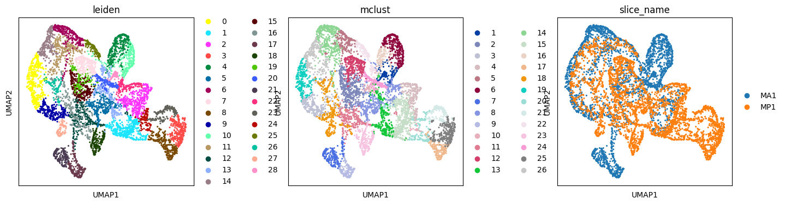
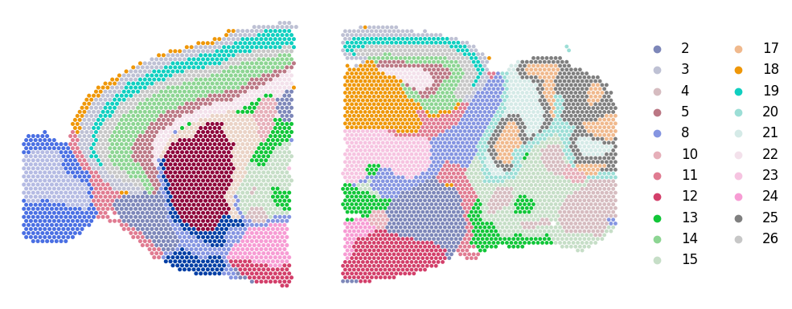

# Tutorial 3: Integrating of anterior and posterior sections of mouse brain
This tutorial demonstrates SMILE's ablility in aligning continous regions. The processed data can be downloaded from <https://figshare.com/articles/dataset/Mouse_Brain_Spatial_Transcriptomics_and_scRNA-seq_data/27897510>


```python
import warnings
warnings.filterwarnings('ignore')
```

```python
from stSMILE import SMILE
```


```python
import scanpy as sc
import anndata as ad
import matplotlib.pyplot as plt
import numpy as np
import pandas as pd
import squidpy as sq
import scipy.sparse as sp
from scipy import sparse
from scipy.sparse import csr_matrix
import math
import torch
import torch.nn as nn
import time
import torch.nn.functional as F
from itertools import chain
from scanpy import read_10x_h5
import torch.optim as optim
import sklearn
from sklearn.neighbors import kneighbors_graph
import gudhi
import networkx as nx
from torch_geometric.nn import GCNConv
import random
import os
import json 
import matplotlib.image as mpimg
```

## Load data


```python
section_ids = ['MA1','MP1']
```

```python
adata_l = []
for i in range(len(section_ids)):
    adata_i = sc.read_h5ad('/Users/lihuazhang/Documents/SMILE-main/dataset/Mouse_Brain/Brain_'+ section_ids[i]+'_ST_final.h5ad')
    adata_l.append(adata_i)
```


```python
# load sc data
adata0_sc = sc.read_h5ad('./dataset/Mouse_Brain/Brain_sc_final.h5ad')
```


```python
adata0_sc
```


    AnnData object with n_obs × n_vars = 5547 × 2978
        obs: 'title', 'source_name', 'organism', 'donor_id', 'donor_sex', 'donor_genotype', 'injection_type', 'injection_target', 'injected_material', 'dissected_region', 'dissected_layer', 'facs_gating', 'facs_date', 'rna_amplification_set', 'sequencing_tube', 'sequencing_batch', 'sequencing_qc_pass_fail', 'cell_class', 'cell_subclass', 'cell_cluster', 'molecule', 'SRA_Run', 'GEO_Sample', 'GEO_Sample_Title', 'n_genes', 'ref'
        var: 'n_cells'
        uns: 'log1p', 'rank_genes_groups'
        obsp: 'adj_f'


```python
cell_subclass = list(set(adata0_sc.obs['cell_subclass'].tolist()))
label0_list = list(set(adata0_sc.obs['cell_subclass'].tolist()))
```

```python
# define ref as new label used 
adata0_label_new = adata0_sc.obs['cell_subclass'].tolist()

for i in range(len(label0_list)):
    need_index = np.where(adata0_sc.obs['cell_subclass'] == label0_list[i])[0]    
    if len(need_index):
        for p in range(len(need_index)):
            adata0_label_new[need_index[p]] = i  
```


```python
adata0_sc.obs['ref'] = pd.Series(adata0_label_new, index = adata0_sc.obs['cell_subclass'].index)
adata0_sc.obs['Ground Truth'] = adata0_sc.obs['cell_subclass']
adata_l.append(adata0_sc)
```


## Run SMILE


```python
tag_l = ['ST','ST','single cell']
in_features = len(adata_l[0].var.index)
hidden_features = 512
out_features = 50
feature_method = 'GCNConv'
alpha = 0.001
beta = 10 
lamb = 0.01 
theta = 0.001 
gamma = 10 # reconstruct 
spatial_regularization_strength= 0.9
lr=1e-3
subepochs=100
epochs=200
max_patience=50
min_stop=20
random_seed=2024
gpu=0
regularization_acceleration=True
edge_subset_sz=1000000
add_topology = True
add_feature = False
add_image = False
add_sc = True
multiscale = True
anchor_type = None
anchors_all = True
use_rep_anchor = 'embedding'
anchor_size=500
iter_comb= None
edge_weights = [1,0.1,0.1]
n_clusters_l = [26]
class_rep = 'reconstruct'
```


```python
adata_l = SMILE(adata_l, tag_l, section_ids, multiscale,  n_clusters_l, in_features, feature_method, hidden_features, out_features, iter_comb, anchors_all, use_rep_anchor, alpha, beta, lamb, theta, gamma,edge_weights, add_topology, add_feature, add_image, add_sc, spatial_regularization_strength, lr=lr, subepochs=subepochs, epochs=epochs, class_rep = class_rep)
```

    Pretraining to extract embeddings of spots...
    epoch   0: train spatial C loss: 0.0000, train F loss: 1.2390,
    epoch  10: train spatial C loss: 0.0000, train F loss: 0.5086,
    epoch  20: train spatial C loss: 0.0000, train F loss: 0.4106,
    epoch  30: train spatial C loss: 0.0000, train F loss: 0.3745,
    epoch  40: train spatial C loss: 0.0000, train F loss: 0.3486,
    epoch  50: train spatial C loss: 0.0000, train F loss: 0.3312,
    epoch  60: train spatial C loss: 0.0000, train F loss: 0.3248,
    epoch  70: train spatial C loss: 0.0000, train F loss: 0.3095,
    epoch  80: train spatial C loss: 0.0000, train F loss: 0.3108,
    epoch  90: train spatial C loss: 0.0000, train F loss: 0.3095,
    Training classifier...
    Training classifier...
    epoch   0: overall loss: 3.4781,sc classifier loss: 3.1545,representation loss: 0.0323,within spatial regularization loss: 0.0814
    epoch  10: overall loss: 0.7843,sc classifier loss: 0.5876,representation loss: 0.0197,within spatial regularization loss: 0.0792
    epoch  20: overall loss: 0.3727,sc classifier loss: 0.1715,representation loss: 0.0201,within spatial regularization loss: 0.1010
    epoch  30: overall loss: 0.2659,sc classifier loss: 0.0787,representation loss: 0.0187,within spatial regularization loss: 0.1055
    epoch  40: overall loss: 0.2252,sc classifier loss: 0.0485,representation loss: 0.0177,within spatial regularization loss: 0.1061
    epoch  50: overall loss: 0.2023,sc classifier loss: 0.0330,representation loss: 0.0169,within spatial regularization loss: 0.1037
    epoch  60: overall loss: 0.1882,sc classifier loss: 0.0244,representation loss: 0.0164,within spatial regularization loss: 0.1020
    epoch  70: overall loss: 0.1788,sc classifier loss: 0.0194,representation loss: 0.0159,within spatial regularization loss: 0.1007
    epoch  80: overall loss: 0.1715,sc classifier loss: 0.0157,representation loss: 0.0156,within spatial regularization loss: 0.0987
    epoch  90: overall loss: 0.1662,sc classifier loss: 0.0133,representation loss: 0.0153,within spatial regularization loss: 0.0973
    epoch 100: overall loss: 0.1621,sc classifier loss: 0.0114,representation loss: 0.0151,within spatial regularization loss: 0.0956
    epoch 110: overall loss: 0.1587,sc classifier loss: 0.0100,representation loss: 0.0149,within spatial regularization loss: 0.0943
    epoch 120: overall loss: 0.1561,sc classifier loss: 0.0089,representation loss: 0.0147,within spatial regularization loss: 0.0930
    epoch 130: overall loss: 0.1538,sc classifier loss: 0.0079,representation loss: 0.0146,within spatial regularization loss: 0.0920
    epoch 140: overall loss: 0.1520,sc classifier loss: 0.0071,representation loss: 0.0145,within spatial regularization loss: 0.0912
    epoch 150: overall loss: 0.1505,sc classifier loss: 0.0063,representation loss: 0.0144,within spatial regularization loss: 0.0906
    epoch 160: overall loss: 0.1492,sc classifier loss: 0.0057,representation loss: 0.0143,within spatial regularization loss: 0.0901
    epoch 170: overall loss: 0.1481,sc classifier loss: 0.0052,representation loss: 0.0143,within spatial regularization loss: 0.0898
    epoch 180: overall loss: 0.1472,sc classifier loss: 0.0047,representation loss: 0.0142,within spatial regularization loss: 0.0895
    epoch 190: overall loss: 0.1464,sc classifier loss: 0.0044,representation loss: 0.0142,within spatial regularization loss: 0.0892
    single cell data classification: Avg Accuracy = 99.963945%


    R[write to console]:                    __           __ 
       ____ ___  _____/ /_  _______/ /_
      / __ `__ \/ ___/ / / / / ___/ __/
     / / / / / / /__/ / /_/ (__  ) /_  
    /_/ /_/ /_/\___/_/\__,_/____/\__/   version 6.1.1
    Type 'citation("mclust")' for citing this R package in publications.
    


    fitting ...
      |======================================================================| 100%
    Identifying anchors...
    Processing datasets (0, 1)
    Aligning by anchors...
    epoch 100: total loss:2.6482, train F loss: 0.3296, train C loss: 3.2787, train D loss: 0.2319
    epoch 110: total loss:0.6462, train F loss: 0.3675, train C loss: 0.9407, train D loss: 0.0279
    epoch 120: total loss:0.4958, train F loss: 0.3433, train C loss: 0.6883, train D loss: 0.0153
    epoch 130: total loss:0.4209, train F loss: 0.3200, train C loss: 0.5971, train D loss: 0.0101
    epoch 140: total loss:0.3897, train F loss: 0.3151, train C loss: 0.5484, train D loss: 0.0075
    epoch 150: total loss:0.3658, train F loss: 0.3073, train C loss: 0.5133, train D loss: 0.0059
    epoch 160: total loss:0.3464, train F loss: 0.2974, train C loss: 0.4892, train D loss: 0.0049
    epoch 170: total loss:0.3377, train F loss: 0.2947, train C loss: 0.4740, train D loss: 0.0043
    epoch 180: total loss:0.3333, train F loss: 0.2931, train C loss: 0.4593, train D loss: 0.0040
    epoch 190: total loss:0.3242, train F loss: 0.2888, train C loss: 0.4382, train D loss: 0.0035
    Updating classifier...
    Training classifier...
    epoch   0: overall loss: 3.4436,sc classifier loss: 3.1177,representation loss: 0.0326,within spatial regularization loss: 0.0811
    epoch  10: overall loss: 0.8686,sc classifier loss: 0.6418,representation loss: 0.0227,within spatial regularization loss: 0.0741
    epoch  20: overall loss: 0.4409,sc classifier loss: 0.2293,representation loss: 0.0212,within spatial regularization loss: 0.0936
    epoch  30: overall loss: 0.3047,sc classifier loss: 0.1016,representation loss: 0.0203,within spatial regularization loss: 0.0999
    epoch  40: overall loss: 0.2505,sc classifier loss: 0.0582,representation loss: 0.0192,within spatial regularization loss: 0.0998
    epoch  50: overall loss: 0.2238,sc classifier loss: 0.0396,representation loss: 0.0184,within spatial regularization loss: 0.0999
    epoch  60: overall loss: 0.2091,sc classifier loss: 0.0295,representation loss: 0.0179,within spatial regularization loss: 0.0972
    epoch  70: overall loss: 0.1988,sc classifier loss: 0.0232,representation loss: 0.0176,within spatial regularization loss: 0.0953
    epoch  80: overall loss: 0.1916,sc classifier loss: 0.0192,representation loss: 0.0172,within spatial regularization loss: 0.0935
    epoch  90: overall loss: 0.1863,sc classifier loss: 0.0163,representation loss: 0.0170,within spatial regularization loss: 0.0919
    epoch 100: overall loss: 0.1820,sc classifier loss: 0.0142,representation loss: 0.0168,within spatial regularization loss: 0.0904
    epoch 110: overall loss: 0.1783,sc classifier loss: 0.0125,representation loss: 0.0166,within spatial regularization loss: 0.0891
    epoch 120: overall loss: 0.1751,sc classifier loss: 0.0110,representation loss: 0.0164,within spatial regularization loss: 0.0882
    epoch 130: overall loss: 0.1723,sc classifier loss: 0.0099,representation loss: 0.0162,within spatial regularization loss: 0.0877
    epoch 140: overall loss: 0.1695,sc classifier loss: 0.0088,representation loss: 0.0161,within spatial regularization loss: 0.0873
    epoch 150: overall loss: 0.1662,sc classifier loss: 0.0080,representation loss: 0.0158,within spatial regularization loss: 0.0867
    epoch 160: overall loss: 0.1626,sc classifier loss: 0.0075,representation loss: 0.0155,within spatial regularization loss: 0.0867
    epoch 170: overall loss: 0.1605,sc classifier loss: 0.0068,representation loss: 0.0154,within spatial regularization loss: 0.0856
    epoch 180: overall loss: 0.1592,sc classifier loss: 0.0062,representation loss: 0.0153,within spatial regularization loss: 0.0847
    epoch 190: overall loss: 0.1576,sc classifier loss: 0.0057,representation loss: 0.0152,within spatial regularization loss: 0.0841
    single cell data classification: Avg Accuracy = 99.945915%


```python
adata_concat_st = ad.concat(adata_l[0:len(section_ids)], label="slice_name", keys=section_ids)
```


```python
sc.tl.pca(adata_concat_st)
adata_concat_st.obsm['X_pca_old'] = adata_concat_st.obsm['X_pca'].copy()
adata_concat_st.obsm['X_pca'] = adata_concat_st.obsm['embedding'].copy()
sc.pp.neighbors(adata_concat_st)  
sc.tl.umap(adata_concat_st)
```


```python
sc.tl.leiden(adata_concat_st, random_state=666, key_added="leiden", resolution=0.75)
len(list(set(adata_concat_st.obs['leiden'].tolist())))
```

    29


## Results and visualizations
```python
from stSMILE import analysis
analysis.mclust_R(adata_concat_st, num_cluster=26, used_obsm="embedding")
```

    fitting ...
      |======================================================================| 100%


    AnnData object with n_obs × n_vars = 6039 × 2978
        obs: 'in_tissue', 'array_row', 'array_col', 'n_genes', 'image_cluster', 'pd_cluster', 'slice_name', 'leiden', 'mclust'
        uns: 'pca', 'neighbors', 'umap', 'leiden'
        obsm: 'features', 'features_summary_scale0.5', 'features_summary_scale1.0', 'features_summary_scale2.0', 'spatial', 'embedding', 'hidden_spatial', 'reconstruct', 'deconvolution', 'X_pca', 'X_pca_old', 'X_umap'
        varm: 'PCs'
        obsp: 'distances', 'connectivities'


```python
plt.rcParams["figure.figsize"] = (4, 4)
sc.pl.umap(adata_concat_st,color=["leiden","mclust",'slice_name'], wspace=0.4, save = 'Mouse_Brain_umap_cluster_SMILE.pdf')  
```

    WARNING: saving figure to file figures/umapMouse_Brain_umap_cluster_SMILE.pdf


    

    


```python
# split to each data
Batch_list = []
for section_id in section_ids:
    Batch_list.append(adata_concat_st[adata_concat_st.obs['slice_name'] == section_id])


import matplotlib.pyplot as plt
spot_size = 120
title_size = 12

fig, ax = plt.subplots(1, 2, figsize=(10, 5), gridspec_kw={'wspace': 0.05, 'hspace': 0.1})
_sc_0 = sc.pl.spatial(Batch_list[0], img_key=None, color=['mclust'], title=[''],
                      legend_loc=None, legend_fontsize=12, show=False, ax=ax[0], frameon=False,
                      spot_size=spot_size)
#_sc_0[0].set_title("ARI=" + str(ARI_list[0]), size=title_size)
_sc_1 = sc.pl.spatial(Batch_list[1], img_key=None, color=['mclust'], title=[''],
                      legend_loc='right margin', legend_fontsize=12, show=False, ax=ax[1], frameon=False,
                      spot_size=spot_size)
#_sc_1[0].set_title("ARI=" + str(ARI_list[1]), size=title_size)
plt.savefig("Mouse_Brain_SMILE_mclust.pdf") 
plt.show()
```


    

    


```python
# write out the result
for i in range(len(section_ids)):
    adata_i = adata_l[i].copy()
    ot_i = adata_i.uns['deconvolution']
    ot_i.to_csv('Mouse_Brain_SMILE_'+ section_ids[i]+'.csv', sep='\t')
    del adata_i.uns['deconvolution']
    del adata_i.uns['deconvolution_pre']
    adata_i.write('Mouse_Brain_SMILE_'+ section_ids[i]+'_ST.h5ad')
    del adata_i
```


```python
adata_i = adata_l[len(section_ids)].copy()
adata_i.write('Mouse_Brain_SMILE_'+ section_ids[i]+'_sc.h5ad')
```


```python
for i in range(len(section_ids)):
    adata_i = adata_l[i].copy()
    df_spa = pd.DataFrame(adata_i.obsm['spatial'], index = adata_i.obs_names, columns = ['x','y'])
    df_spa.to_csv('Mouse_Brain_'+ section_ids[i]+'_spatial.csv', sep='\t')
```

