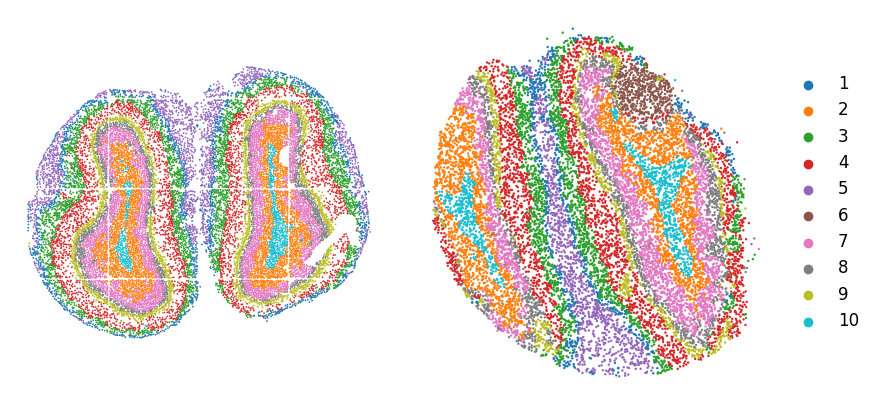

# Tutorial 5: Integrating MOB data from Stereo-seq and Slide-seqV2
This tutorial demonstrates SMILE's ablility to integrate two SRT data coming from Stereo-seq and Slide-seqV2. The processed data can be downloaded from <https://figshare.com/articles/dataset/spatial_transcriptomics_data_and_scRNA-seq_data_of_MOB/27997628>


```python
import warnings
warnings.filterwarnings('ignore')
```

```python
from stSMILE import SMILE
```


```python
import scanpy as sc
import anndata as ad
import matplotlib.pyplot as plt
import numpy as np
import pandas as pd
import squidpy as sq
import scipy.sparse as sp
from scipy import sparse
from scipy.sparse import csr_matrix
import math
import torch
import torch.nn as nn
import time
import torch.nn.functional as F
from itertools import chain
from scanpy import read_10x_h5
import torch.optim as optim
import sklearn
from sklearn.neighbors import kneighbors_graph
import gudhi
import networkx as nx
from torch_geometric.nn import GCNConv
import random
import os
import json 
import matplotlib.image as mpimg
```

## Load data


```python
section_ids = ['Stereo-seq','Slide-seqV2']
```


```python
adata_l = []
for i in range(len(section_ids)):
    adata_i = sc.read_h5ad('./dataset/MOB/MOB_'+ section_ids[i]+'_ST_final.h5ad')
    adata_l.append(adata_i)
```


```python
# load sc data
adata0_sc = sc.read_h5ad('./dataset/MOB/MOB_sc_final.h5ad')
```


```python
adata0_sc
```


    AnnData object with n_obs × n_vars = 9855 × 2373
        obs: 'X', 'nGene', 'nUMI', 'orig.ident', 'experiment', 'percent.mito', 'res.1.6', 'ClusterName', 'n_genes', 'ref'
        var: 'n_cells'
        uns: 'rank_genes_groups'
        obsp: 'adj_f'


```python
cell_subclass = list(set(adata0_sc.obs['ClusterName'].tolist()))
label0_list = list(set(adata0_sc.obs['ClusterName'].tolist()))
```

```python
# define ref as new label used 
adata0_label_new = adata0_sc.obs['ClusterName'].tolist()

for i in range(len(label0_list)):
    need_index = np.where(adata0_sc.obs['ClusterName'] == label0_list[i])[0]    
    if len(need_index):
        for p in range(len(need_index)):
            adata0_label_new[need_index[p]] = i  
```


```python
adata0_sc.obs['ref'] = pd.Series(adata0_label_new, index = adata0_sc.obs['ClusterName'].index)
adata0_sc.obs['Ground Truth'] = adata0_sc.obs['ClusterName']
adata_l.append(adata0_sc)
```


## Run SMILE

```python
tag_l = ['ST','ST','single cell']
in_features = len(adata_l[0].var.index)
hidden_features = 512
out_features = 50
feature_method = 'GCNConv'
alpha = 0.001
beta = 1 
lamb = 0.01 
theta = 0.001 
gamma = 10 # reconstruct 
spatial_regularization_strength= 0.9
lr=1e-3
subepochs=100
epochs=200
max_patience=50
min_stop=20
random_seed=2024
gpu=0
regularization_acceleration=True
edge_subset_sz=1000000
add_topology = True
add_feature = False
add_image = False
add_sc = True
multiscale = True
anchor_type = None
anchors_all = True
use_rep_anchor = 'embedding'
anchor_size=5000
iter_comb= None
edge_weights = [1,0.1,0.1]
n_clusters_l = [10]
class_rep = 'reconstruct'
```


```python
adata_l = SMILE(adata_l, tag_l, section_ids, multiscale,  n_clusters_l, in_features, feature_method, hidden_features, out_features, iter_comb, anchors_all, use_rep_anchor, alpha, beta, lamb, theta, gamma,edge_weights, add_topology, add_feature, add_image, add_sc, spatial_regularization_strength, lr=lr, subepochs=subepochs, epochs=epochs, class_rep = class_rep)
```

    Pretraining to extract embeddings of spots...
    epoch   0: train spatial C loss: 0.0000, train F loss: 1.3654,
    epoch  10: train spatial C loss: 0.0000, train F loss: 1.0638,
    epoch  20: train spatial C loss: 0.0000, train F loss: 1.0345,
    epoch  30: train spatial C loss: 0.0000, train F loss: 1.0142,
    epoch  40: train spatial C loss: 0.0000, train F loss: 1.0102,
    epoch  50: train spatial C loss: 0.0000, train F loss: 0.9805,
    epoch  60: train spatial C loss: 0.0000, train F loss: 0.9778,
    epoch  70: train spatial C loss: 0.0000, train F loss: 0.9660,
    epoch  80: train spatial C loss: 0.0000, train F loss: 0.9554,
    epoch  90: train spatial C loss: 0.0000, train F loss: 0.9513,
    Training classifier...
    Training classifier...
    epoch   0: overall loss: 3.8557,sc classifier loss: 3.7134,representation loss: 0.0142,within spatial regularization loss: 0.1307
    epoch  10: overall loss: 1.6259,sc classifier loss: 1.5372,representation loss: 0.0089,within spatial regularization loss: 0.0966
    epoch  20: overall loss: 0.9607,sc classifier loss: 0.8781,representation loss: 0.0082,within spatial regularization loss: 0.1295
    epoch  30: overall loss: 0.7418,sc classifier loss: 0.6569,representation loss: 0.0085,within spatial regularization loss: 0.1555
    epoch  40: overall loss: 0.6322,sc classifier loss: 0.5469,representation loss: 0.0085,within spatial regularization loss: 0.1702
    epoch  50: overall loss: 0.5720,sc classifier loss: 0.4864,representation loss: 0.0086,within spatial regularization loss: 0.1748
    epoch  60: overall loss: 0.5322,sc classifier loss: 0.4465,representation loss: 0.0086,within spatial regularization loss: 0.1762
    epoch  70: overall loss: 0.5032,sc classifier loss: 0.4178,representation loss: 0.0085,within spatial regularization loss: 0.1775
    epoch  80: overall loss: 0.4799,sc classifier loss: 0.3950,representation loss: 0.0085,within spatial regularization loss: 0.1783
    epoch  90: overall loss: 0.4596,sc classifier loss: 0.3753,representation loss: 0.0084,within spatial regularization loss: 0.1786
    epoch 100: overall loss: 0.4410,sc classifier loss: 0.3571,representation loss: 0.0084,within spatial regularization loss: 0.1787
    epoch 110: overall loss: 0.4237,sc classifier loss: 0.3400,representation loss: 0.0083,within spatial regularization loss: 0.1791
    epoch 120: overall loss: 0.4071,sc classifier loss: 0.3236,representation loss: 0.0083,within spatial regularization loss: 0.1796
    epoch 130: overall loss: 0.3919,sc classifier loss: 0.3086,representation loss: 0.0083,within spatial regularization loss: 0.1800
    epoch 140: overall loss: 0.3766,sc classifier loss: 0.2935,representation loss: 0.0083,within spatial regularization loss: 0.1809
    epoch 150: overall loss: 0.3626,sc classifier loss: 0.2796,representation loss: 0.0083,within spatial regularization loss: 0.1819
    epoch 160: overall loss: 0.3493,sc classifier loss: 0.2663,representation loss: 0.0083,within spatial regularization loss: 0.1826
    epoch 170: overall loss: 0.3373,sc classifier loss: 0.2545,representation loss: 0.0083,within spatial regularization loss: 0.1840
    epoch 180: overall loss: 0.3245,sc classifier loss: 0.2417,representation loss: 0.0083,within spatial regularization loss: 0.1846
    epoch 190: overall loss: 0.3132,sc classifier loss: 0.2304,representation loss: 0.0083,within spatial regularization loss: 0.1852
    single cell data classification: Avg Accuracy = 92.876714%


    R[write to console]:                    __           __ 
       ____ ___  _____/ /_  _______/ /_
      / __ `__ \/ ___/ / / / / ___/ __/
     / / / / / / /__/ / /_/ (__  ) /_  
    /_/ /_/ /_/\___/_/\__,_/____/\__/   version 6.1.1
    Type 'citation("mclust")' for citing this R package in publications.
    


    fitting ...
      |======================================================================| 100%
    Identifying anchors...
    Processing datasets (0, 1)
    Aligning by anchors...
    epoch 100: total loss:1.0212, train F loss: 0.9570, train C loss: 2.2820, train D loss: 0.0641
    epoch 110: total loss:0.9978, train F loss: 0.9584, train C loss: 1.1480, train D loss: 0.0394
    epoch 120: total loss:0.9847, train F loss: 0.9503, train C loss: 0.9109, train D loss: 0.0343
    epoch 130: total loss:0.9812, train F loss: 0.9489, train C loss: 0.7977, train D loss: 0.0323
    epoch 140: total loss:0.9663, train F loss: 0.9349, train C loss: 0.7232, train D loss: 0.0315
    epoch 150: total loss:0.9630, train F loss: 0.9324, train C loss: 0.6724, train D loss: 0.0306
    epoch 160: total loss:0.9588, train F loss: 0.9291, train C loss: 0.6357, train D loss: 0.0297
    epoch 170: total loss:0.9585, train F loss: 0.9292, train C loss: 0.5975, train D loss: 0.0292
    epoch 180: total loss:0.9555, train F loss: 0.9267, train C loss: 0.5719, train D loss: 0.0288
    epoch 190: total loss:0.9485, train F loss: 0.9200, train C loss: 0.5552, train D loss: 0.0284
    Updating classifier...
    Training classifier...
    epoch   0: overall loss: 3.8468,sc classifier loss: 3.6965,representation loss: 0.0150,within spatial regularization loss: 0.1226
    epoch  10: overall loss: 1.6347,sc classifier loss: 1.5335,representation loss: 0.0101,within spatial regularization loss: 0.0839
    epoch  20: overall loss: 0.9280,sc classifier loss: 0.8359,representation loss: 0.0092,within spatial regularization loss: 0.1176
    epoch  30: overall loss: 0.7150,sc classifier loss: 0.6217,representation loss: 0.0093,within spatial regularization loss: 0.1485
    epoch  40: overall loss: 0.6146,sc classifier loss: 0.5211,representation loss: 0.0093,within spatial regularization loss: 0.1624
    epoch  50: overall loss: 0.5614,sc classifier loss: 0.4681,representation loss: 0.0093,within spatial regularization loss: 0.1646
    epoch  60: overall loss: 0.5244,sc classifier loss: 0.4317,representation loss: 0.0093,within spatial regularization loss: 0.1648
    torch.Size([14154, 40])
    epoch  70: overall loss: 0.4968,sc classifier loss: 0.4041,representation loss: 0.0092,within spatial regularization loss: 0.1662
    epoch  80: overall loss: 0.4733,sc classifier loss: 0.3813,representation loss: 0.0092,within spatial regularization loss: 0.1660
    epoch  90: overall loss: 0.4526,sc classifier loss: 0.3608,representation loss: 0.0092,within spatial regularization loss: 0.1660
    epoch 100: overall loss: 0.4336,sc classifier loss: 0.3421,representation loss: 0.0091,within spatial regularization loss: 0.1663
    epoch 110: overall loss: 0.4186,sc classifier loss: 0.3272,representation loss: 0.0091,within spatial regularization loss: 0.1670
    epoch 120: overall loss: 0.4014,sc classifier loss: 0.3102,representation loss: 0.0091,within spatial regularization loss: 0.1675
    epoch 130: overall loss: 0.3864,sc classifier loss: 0.2954,representation loss: 0.0091,within spatial regularization loss: 0.1680
    epoch 140: overall loss: 0.3726,sc classifier loss: 0.2817,representation loss: 0.0091,within spatial regularization loss: 0.1685
    epoch 150: overall loss: 0.3592,sc classifier loss: 0.2685,representation loss: 0.0091,within spatial regularization loss: 0.1691
    torch.Size([14154, 40])
    epoch 160: overall loss: 0.3512,sc classifier loss: 0.2604,representation loss: 0.0091,within spatial regularization loss: 0.1697
    epoch 170: overall loss: 0.3367,sc classifier loss: 0.2462,representation loss: 0.0090,within spatial regularization loss: 0.1705
    epoch 180: overall loss: 0.3247,sc classifier loss: 0.2343,representation loss: 0.0090,within spatial regularization loss: 0.1710
    epoch 190: overall loss: 0.3136,sc classifier loss: 0.2234,representation loss: 0.0090,within spatial regularization loss: 0.1715
    single cell data classification: Avg Accuracy = 93.039066%


```python
adata_concat_st = ad.concat(adata_l[0:len(section_ids)], label="slice_name", keys=section_ids)
```


```python
sc.tl.pca(adata_concat_st)
adata_concat_st.obsm['X_pca_old'] = adata_concat_st.obsm['X_pca'].copy()
adata_concat_st.obsm['X_pca'] = adata_concat_st.obsm['embedding'].copy()
sc.pp.neighbors(adata_concat_st)  
sc.tl.umap(adata_concat_st)
```


```python
sc.tl.leiden(adata_concat_st, random_state=666, key_added="leiden", resolution=0.35)
```


## Results and visualizations
```python
from stSMILE import analysis
analysis.mclust_R(adata_concat_st, num_cluster=10, used_obsm="embedding")
```

    fitting ...
      |======================================================================| 100%


    AnnData object with n_obs × n_vars = 32263 × 2373
        obs: 'n_genes', 'pd_cluster', 'slice_name', 'leiden', 'mclust'
        uns: 'pca', 'neighbors', 'umap', 'leiden', 'leiden_colors', 'mclust_colors', 'slice_name_colors'
        obsm: 'spatial', 'embedding', 'hidden_spatial', 'reconstruct', 'deconvolution', 'X_pca', 'X_pca_old', 'X_umap'
        varm: 'PCs'
        obsp: 'distances', 'connectivities'


```python
# split to each data
Batch_list = []
for section_id in section_ids:
    Batch_list.append(adata_concat_st[adata_concat_st.obs['slice_name'] == section_id])


import matplotlib.pyplot as plt
spot_size = 30
title_size = 12

fig, ax = plt.subplots(1, 2, figsize=(10, 5), gridspec_kw={'wspace': 0.05, 'hspace': 0.1})
_sc_0 = sc.pl.spatial(Batch_list[0], img_key=None, color=['mclust'], title=[''],
                      legend_loc=None, legend_fontsize=12, show=False, ax=ax[0], frameon=False,
                      spot_size=spot_size)
#_sc_0[0].set_title("ARI=" + str(ARI_list[0]), size=title_size)
_sc_1 = sc.pl.spatial(Batch_list[1], img_key=None, color=['mclust'], title=[''],
                      legend_loc='right margin', legend_fontsize=12, show=False, ax=ax[1], frameon=False,
                      spot_size=spot_size)
#_sc_1[0].set_title("ARI=" + str(ARI_list[1]), size=title_size)
plt.savefig("MOB_SMILE_mclust.pdf") 
plt.show()
```


    

    


```python
# write out the result
for i in range(len(section_ids)):
    adata_i = adata_l[i].copy()
    ot_i = adata_i.uns['deconvolution']
    ot_i.to_csv('MOB_SMILE_'+ section_ids[i]+'.csv', sep='\t')
    del adata_i.uns['deconvolution']
    del adata_i.uns['deconvolution_pre']
    adata_i.write('MOB_SMILE_'+ section_ids[i]+'_ST.h5ad')
    del adata_i
```


```python
adata_i = adata_l[len(section_ids)].copy()
adata_i.write('MOB_SMILE_'+ section_ids[i]+'_sc.h5ad')
```


```python
for i in range(len(section_ids)):
    adata_i = adata_l[i].copy()
    df_spa = pd.DataFrame(adata_i.obsm['spatial'], index = adata_i.obs_names, columns = ['x','y'])
    df_spa.to_csv('MOB_'+ section_ids[i]+'_spatial.csv', sep='\t')
```

